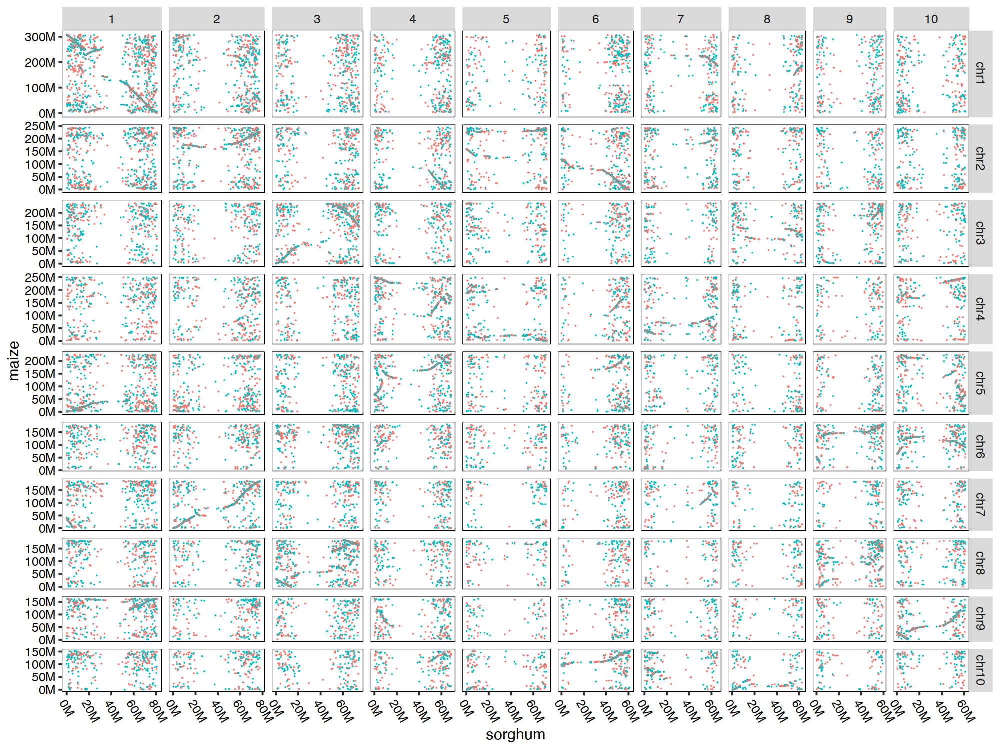
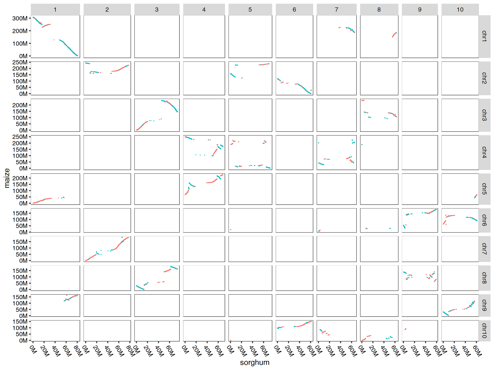

# quota_Anchor
Here are the scripts and documents to conduct strand and WGD aware syntenic gene identification for a pair of genomes using the longest path algorithm implemented in AnchorWave and recognize different gene types of maize.
## Dependencies
AnchorWave \
[gffread](https://github.com/gpertea/gffread) \
python3 \
[NumPy](https://numpy.org/) \
subprocess \
plotnine \
pandas \
argparse \
configparser \
BLAST or [DIAMOND](https://github.com/bbuchfink/diamond) \
[muscle5.1.linux_intel64](https://github.com/rcedgar/muscle/releases/download/5.1.0/muscle5.1.linux_intel64)  \
[mafft](https://mafft.cbrc.jp/alignment/software/)  \
[yn00](http://abacus.gene.ucl.ac.uk/software/paml.html#download)  \
[pal2nal.pl](https://www.bork.embl.de/pal2nal/#Download) \
You should modify config_file/software_path.ini parameter
## Installation
You can simple by the following code get this software.
```
git clone https://github.com/baoxingsong/quota_Anchor.git
```
## Usage
### Help info
```
python main.py -h
```
```
usage: main.py [-h] {pre_col,col,dotplot,pre_ks,ks,block_info,kp,pf,kf,class_gene} ...

collinearity gene analysis

options:
  -h, --help            show this help message and exit

gene collinearity analysis:
  {pre_col,col,dotplot,pre_ks,ks,block_info,kp,pf,kf,class_gene}
    pre_col             get longest protein and AnchorWave pro(collinearity) input file
    col                 get gene collinearity file by AnchorWave pro command
    dotplot             collinearity dotplot or blast dotplot
    pre_ks              get longest cds
    ks                  get ks and ka information
    block_info          summary block information
    kp                  ks(total, average, median) probability density function curve
    pf                  ks probability density function curve fitting
    kf                  ks distribution figure
    class_gene          class gene as tandem, proximal, transposed, wgd/segmental, dispersed, singletons
```
## Example
### Genome and annotation data preparation
Here is an example to identify syntenic genes between maize and sorghum and different gene types of maize. The maize lineage has undergone a whole genome duplication (WGD) since its divergence with sorghum, but subsequent chromosomal fusions resulted in these species having the same chromosome number (n = 10). AnchorWave can allow up to two collinear paths for each sorghum anchor while one collinear path for each maize anchor.
### Data prepare
```
wget https://download.maizegdb.org/Zm-B73-REFERENCE-NAM-5.0/Zm-B73-REFERENCE-NAM-5.0.fa.gz
wget https://download.maizegdb.org/Zm-B73-REFERENCE-NAM-5.0/Zm-B73-REFERENCE-NAM-5.0_Zm00001eb.1.gff3.gz
wget https://ftp.ensemblgenomes.ebi.ac.uk/pub/plants/release-57/fasta/sorghum_bicolor/dna/Sorghum_bicolor.Sorghum_bicolor_NCBIv3.dna.toplevel.fa.gz
wget https://ftp.ensemblgenomes.ebi.ac.uk/pub/plants/release-57/gff3/sorghum_bicolor/Sorghum_bicolor.Sorghum_bicolor_NCBIv3.57.gff3.gz
gunzip *gz
```
### Modify config file(lib/pre_collinearity.conf) and running pre_collineaity(maize vs sorghum)
This includes four stepsn \
1.Extract and translate protein sequences from genome sequences and annotations \
2. Identify and extract the longest protein sequence encoded by each gene \
3. protein sequence alignment using DIAMOND Or conduct protein sequence alignment using BLASTp \
4. Put the gene strand information and the blast result into a single file
```
[gffread]
ref_genome_seq = Sorghum_bicolor.Sorghum_bicolor_NCBIv3.dna.toplevel.fa
ref_gff_file = Sorghum_bicolor.Sorghum_bicolor_NCBIv3.57.gff3
output_ref_pep_seq = sb.p.fa
query_genome_seq = Zm-B73-REFERENCE-NAM-5.0.fa
query_gff_file = Zm-B73-REFERENCE-NAM-5.0_Zm00001eb.1.gff3
output_query_pep_seq = zm.p.fa
# The next line is the description of the S parameter of gffread, you need to set True in general.
# -S    for -y option, use '*' instead of '.' as stop codon translation
use_S_parameter = True

[longest_pep]
out_ref_longest_pep_name = sorghum.protein.fa
out_query_longest_pep_name = maize.protein.fa

[align]
align=diamond

[diamond]
# use ref protein seq construct database
database_name = sb_db
output_blast_result = sorghum.maize.blastp
max_target_seqs = 20
evalue = 1e-10

[blastp]
database_name = sb
dtype = prot
output_blast_result = sorghum.maize.blastp
evalue = 1e-10
max_target_seqs = 20
thread = 6
outfmt = 6

[combineBlastAndStrand]
out_file = sorghum.maize.table
bitscore = 100
align_length = 100
```
```
python main.py pre_col
```
### Collinearity analysis(maize vs sorghum)
modify config file and running colllinearity analysis.
```
[AnchorWave]
# The R value indicates the maximum number of occurrences of a gene in the collinearity file, and Q means the same as R.
R = 2
Q = 1
maximum_gap_size = 10
delete_tandem = 0
tandem_dis = 5
input_file_name = sorghum.maize.table
output_coll_name = sorghum.maize.collinearity
```
```
python main.py col
```
### Visualzing by R code
The table could be visualized via the following R code:
```
library(ggplot2)
changetoM <- function ( position ){
  position=position/1000000;
  paste(position, "M", sep="")
}
data =read.table("sorghum.maize.table")
data$strand = data$V6==data$V12
data[which(data$strand),]$strand = "+"
data[which(data$strand==FALSE),]$strand = "-"

data = data[which(data$V8 %in% c("1", "2", "3", "4", "5", "6", "7", "8", "9", "10")),]
data = data[which(data$V2 %in% c("chr1", "chr2", "chr3", "chr4", "chr5", "chr6", "chr7", "chr8", "chr9", "chr10")),]
data$V8 = factor(data$V8, levels=c("1", "2", "3", "4", "5", "6", "7", "8", "9", "10"))
data$V2 = factor(data$V2, levels=c("chr1", "chr2", "chr3", "chr4", "chr5", "chr6", "chr7", "chr8", "chr9", "chr10"))

plot = ggplot(data=data, aes(x=V10, y=V4))+geom_point(size=0.5, aes(color=strand))+facet_grid(V2~V8, scales="free", space="free" )+ theme_grey(base_size = 30) +
    labs(x="sorghum", y="maize")+scale_x_continuous(labels=changetoM) + scale_y_continuous(labels=changetoM) +
    theme(axis.line = element_blank(),
          panel.background = element_blank(),
          panel.border = element_rect(fill=NA,color="black", linewidth=0.5, linetype="solid"),
          axis.text.y = element_text( colour = "black"),
          legend.position='none',
          axis.text.x = element_text(angle=300, hjust=0, vjust=1, colour = "black") )
png("sorghum.maize.table.png" , width=2000, height=1500)
plot
dev.off()
```
<p align="center">

</p>

This file of `sorghum.maize.colinearity` could be visualized via the following R code:
```
library(ggplot2)
changetoM <- function ( position ){
  position=position/1000000;
  paste(position, "M", sep="")
}

data = read.table("sorghum.maize.colinearity.collinearity", header=T)
data = data[which(data$refChr %in% c("1", "2", "3", "4", "5", "6", "7", "8", "9", "10")),]
data = data[which(data$queryChr %in% c("chr1", "chr2", "chr3", "chr4", "chr5", "chr6", "chr7", "chr8", "chr9", "chr10")),]
data$refChr = factor(data$refChr, levels=c("1", "2", "3", "4", "5", "6", "7", "8", "9", "10"))
data$queryChr = factor(data$queryChr, levels=c("chr1", "chr2", "chr3", "chr4", "chr5", "chr6", "chr7", "chr8", "chr9", "chr10"))

plot = ggplot(data=data, aes(x=queryStart, y=referenceStart))+geom_point(size=0.5, aes(color=strand))+facet_grid(refChr~queryChr, scales="free", space="free" )+ 
  theme_grey(base_size = 30) +
  labs(x="maize", y="sorghum")+scale_x_continuous(labels=changetoM) + scale_y_continuous(labels=changetoM) +
  theme(axis.line = element_blank(),
        panel.background = element_blank(),
        panel.border = element_rect(fill=NA,color="black", linewidth=0.5, linetype="solid"),
        axis.text.y = element_text( colour = "black"),
        legend.position='none',
        axis.text.x = element_text(angle=300, hjust=0, vjust=1, colour = "black") )

png("sorghum.maize.colinearity.png" , width=2000, height=1500)
plot
dev.off()
```
<p align="center">

</p>

### Collineaity analysis(maize vs maize )
You should do this using the same steps as maize vs sorghum.
The following is config file(pre_collinearity.conf and collinearity.conf).
pre_collinearity.conf file
```
[gffread]
ref_genome_seq = Zm-B73-REFERENCE-NAM-5.0.fa
ref_gff_file = Zm-B73-REFERENCE-NAM-5.0_Zm00001eb.1.gff3
output_ref_pep_seq = zm.p.fa
query_genome_seq = Zm-B73-REFERENCE-NAM-5.0.fa
query_gff_file = Zm-B73-REFERENCE-NAM-5.0_Zm00001eb.1.gff3
output_query_pep_seq = zm.p.fa
# The next line is the description of the S parameter of gffread, you need to set True in general.
# -S    for -y option, use '*' instead of '.' as stop codon translation
use_S_parameter = True

[longest_pep]
out_ref_longest_pep_name = maize.protein.fa
out_query_longest_pep_name = maize.protein.fa

[align]
align=diamond

[diamond]
# use ref protein seq construct database
database_name = zm_db
output_blast_result = maize.maize.blastp
max_target_seqs = 20
evalue = 1e-10

[blastp]
database_name = maize
dtype = prot
output_blast_result = zm.zm.blastp
evalue = 1e-10
max_target_seqs = 20
thread = 6
outfmt = 6

[combineBlastAndStrand]
out_file = maize.maize.table
bitscore = 100
align_length = 100
```
collinearity.conf file
```
[AnchorWave]
# The R value indicates the maximum number of occurrences of a gene in the collinearity file, and Q means the same as R.
R = 2
Q = 1
maximum_gap_size = 10
delete_tandem = 0
tandem_dis = 5
input_file_name = maize.maize.table
output_coll_name = maize.maize.collinearity
```
### Gene classification
modify config file (classification_gene.conf) and running classification analysis.
```
[classification]
# query is target species
query_table = maize.maize.table
query_gff_file = Zm-B73-REFERENCE-NAM-5.0_Zm00001eb.1.gff3
query_query_collinearity = maize_maize.collinearity
query_ref_collinearity = sorghum.maize.collinearity
out_directory = /you/out/directory
out_prefix = maize
# 1 or 0(are wgd/segmental duplicates ancestral loci or not? default: 1, yes)
seg_anc = 1
# is each duplicate gene type unique after all of the duplicated gene pairs were classified into different gene duplication types? (1 or 0) 
type = 1
proximal_max_distance = 10
```
```
python main.py class_gene
```