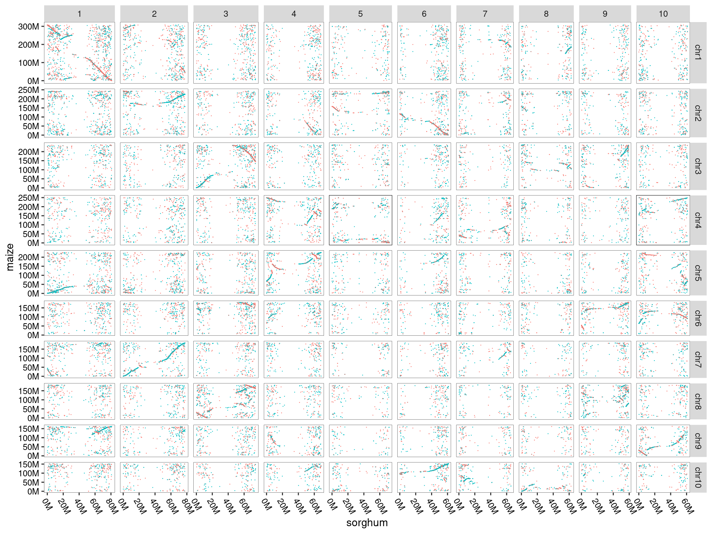
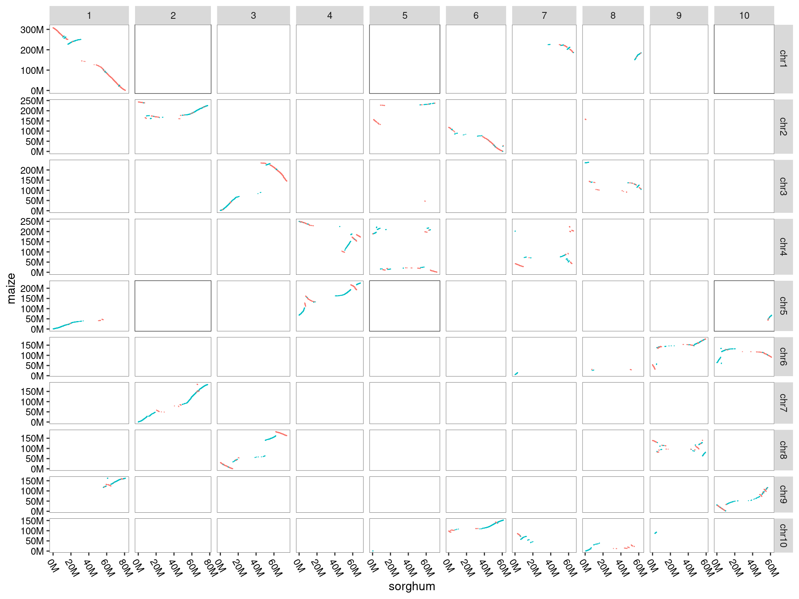
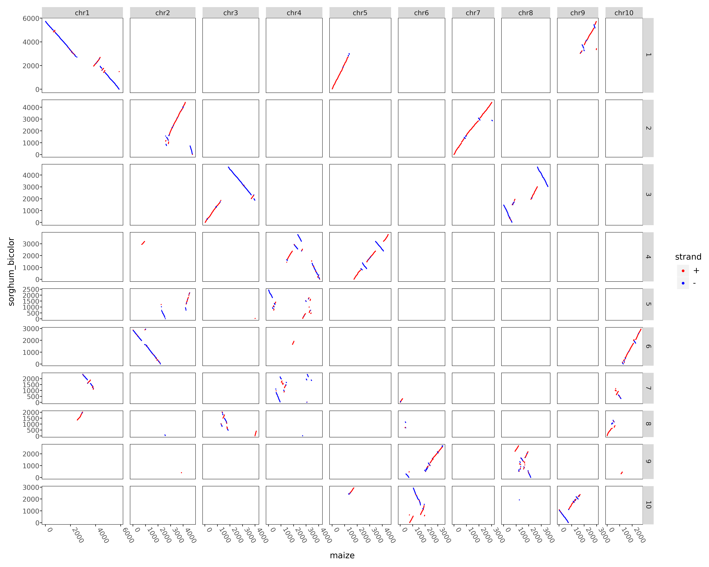
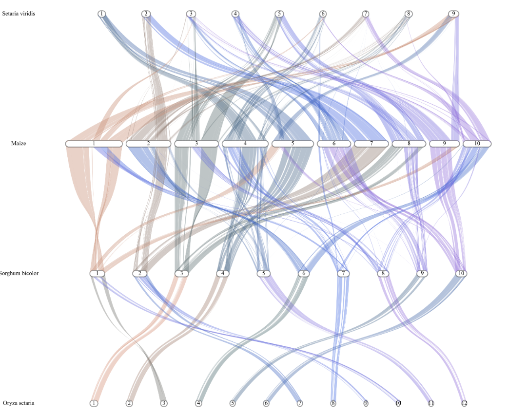

# quota_Anchor( Proustian monstrosity)
Here are the scripts and documents to conduct strand and WGD aware syntenic gene identification for a pair of genomes using the longest path algorithm implemented in AnchorWave. We currently provide three visualization methods for syntenic results.
## Installation
You can simple by the following command get this software in a independent conda envirment. This is a beta version, so we haven't uploaded it to bioconda yet.
```
conda install xiaodli::quota_anchor
```
## Usage
### Help info
```
quota_Anchor -h
```
```
usage: quota_Anchor [-h] [-v] {pre_col,col,get_chr_length,dotplot,circle,line_2,line_proali} ...

Conduct strand and WGD aware syntenic gene identification for a pair of genomes using the longest path algorithm implemented in AnchorWave:
options:
  -h, --help            show this help message and exit
  -v, --version         show program's version number and exit

gene collinearity analysis:
  {pre_col,col,get_chr_length,dotplot,circle,line_2,line_proali}
    pre_col             Get longest protein file from gffread result and input file for gene collinearity analysis
    col                 Get gene collinearity result file
    get_chr_length      Get chromosome length and name info from fai file
    dotplot             Collinearity result visualization
    circle              Collinearity result visualization
    line_2              Collinearity result visualization
    line_proali         Anchors file from AnchorWave proali visualization
```
## Example
Here is an example to identify syntenic genes between maize and sorghum. The maize lineage has undergone a whole genome duplication (WGD) since its divergence with sorghum, but subsequent chromosomal fusions resulted in these species having the same chromosome number (n = 10). AnchorWave can allow up to two collinear paths for each sorghum anchor while one collinear path for each maize anchor.
### Make some folders rather than a folder may be more clearer
Working directory structure are as follows. We may give you an option to create this directory later, but you will need to do it yourself now.
```
├── length_file
│   └── get_length.conf
├── raw_data
│   ├── Sorghum_bicolor.Sorghum_bicolor_NCBIv3.57.gff3
│   ├── Sorghum_bicolor.Sorghum_bicolor_NCBIv3.dna.toplevel.fa
│   ├── Zm-B73-REFERENCE-NAM-5.0.fa
│   └── Zm-B73-REFERENCE-NAM-5.0_Zm00001eb.1.gff3
└── sb_zm
    └── config_file
        ├── circle.conf
        ├── collinearity.conf
        ├── dotplot.conf
        ├── line.conf
        └── pre_collinearity.conf
```
### Genome and annotation data preparation
Put the genome and gff file into the sb_zm/raw_data directory.
```
wget https://download.maizegdb.org/Zm-B73-REFERENCE-NAM-5.0/Zm-B73-REFERENCE-NAM-5.0.fa.gz
wget https://download.maizegdb.org/Zm-B73-REFERENCE-NAM-5.0/Zm-B73-REFERENCE-NAM-5.0_Zm00001eb.1.gff3.gz
wget https://ftp.ensemblgenomes.ebi.ac.uk/pub/plants/release-57/fasta/sorghum_bicolor/dna/Sorghum_bicolor.Sorghum_bicolor_NCBIv3.dna.toplevel.fa.gz
wget https://ftp.ensemblgenomes.ebi.ac.uk/pub/plants/release-57/gff3/sorghum_bicolor/Sorghum_bicolor.Sorghum_bicolor_NCBIv3.57.gff3.gz
gunzip *gz
```
### Modify config file and running pre_collinearity(maize vs sorghum)
This includes four steps(implemented in "quota_Anchor pre_col")
1. Extract and translate protein sequences from genome sequences and annotations
2. Identify and extract the longest protein sequence encoded by each gene
3. Protein sequence alignment using DIAMOND or conduct protein sequence alignment using BLASTp
4. Put the gene strand information and the blast result into a single file

<table border="2" align=center>
	<tr>
		<th colspan="1" style="text-align: center;">Header</th>
		<th colspan="1" style="text-align: center;">Parameter</th>
    <th colspan="1" style="text-align: center;">Description</th>
	</tr>
	<tr>
		<td width="10%" rowspan="7" align =center>[gffread]</td>
		<td width="10%" align =center>ref_genome_seq</td>
		<td align =center >Please provide e path to your reference FASTA file</td>
	</tr>
	<tr>
		<td align =center>ref_gff_file</td>
		<td align =center >Please provide a path to your reference GFF file</td>
	</tr>
	<tr>
		<td align =center>output_ref_pep_seq</td>
		<td align =center >Please type a filename for the reference protein sequence file that the software will generate</td>
	</tr>
	<tr>
		<td align =center>query_genome_seq</td>
		<td align =center >Please provide a path to your Query FASTA file</td>
	</tr>
  	<tr>
		<td align =center>query_gff_file</td>
		<td align =center >Please provide a path to your Query GFF file</td>
	</tr>
  	<tr>
		<td align =center>output_query_pep_seq</td>
		<td align =center >Please type a filename for a query protein sequence file that the software will generate</td>
	</tr>
  	<tr>
		<td align =center>use_S_parameter</td>
		<td align =center >When using gffread -y option, whether the -S parameter is used, which means using '*' instead of '.' as the stop codon for translation(<font color=red>Not recommended to modify, default:True</font>)</td>
	<tr>
		<td width="10%" rowspan="2" align =center>[longest_pep]</td>
		<td width="10%" align =center>out_ref_longest_pep_name</td>
		<td align =center >Please type a filename for longest protein sequence file that software will generate</td>
	</tr>
	<tr>
		<td align =center>out_query_longest_pep_name</td>
		<td align =center >Please type a filename for longest protein sequence file that software will generate</td>
	</tr>
  	<tr>
		<td width="10%" rowspan="1" align =center>[align]</td>
		<td width="10%" align =center>align</td>
		<td align =center >Protein sequence alignment using DIAMOND or  BLASTp(please type: <font color=red>diamond or blastp</font>)</td>
	</tr>
  	</tr>
  	<tr>
		<td width="10%" rowspan="4" align =center>[diamond]</td>
		<td width="10%" align =center>database_name</td>
		<td align =center >Please type a diamond-blastp database Path/Name that software will generate</td>
	</tr>
	<tr>
		<td align =center>output_blast_result</td>
		<td align =center >Please type a diamond-blastp result Path that software will generate</td>
	</tr>
  	<tr>
		<td align =center>max_target_seqs</td>
		<td align =center >Maximum number of target sequences to report alignments for diamond-blastp</td>
	</tr>
  	<tr>
		<td align =center>evalue</td>
		<td align =center > Maximum e-value to report alignments</td>
	</tr>
  <tr>
		<td width="10%" rowspan="7" align =center>[blastp]</td>
		<td width="10%" align =center>database_name</td>
		<td align =center >Please type a blastp database Path/Name that software will generate</td>
	</tr>
	<tr>
		<td align =center>dtype</td>
		<td align =center >Database date type(please type:<font color=red>prot</font>)</td>
	</tr>
	<tr>
		<td align =center>output_blast_result</td>
		<td align =center >Please type a blastp result Path that software will generate</td>
	</tr>
	<tr>
		<td align =center>evalue</td>
		<td align =center >Maximum e-value to report alignments</td>
	</tr>
  	<tr>
		<td align =center>max_target_seqs</td>
		<td align =center >Maximum number of target sequences to report alignments for diamond-blastp</td>
	</tr>
  	<tr>
		<td align =center>thread</td>
		<td align =center >Number of CPU threads</td>
	</tr>
  	<tr>
		<td align =center>outfmt</td>
		<td align =center >	Please type <font color=red>6</font>(BLAST tabular)</td>
	<tr>
  <tr>
		<td width="10%" rowspan="3" align =center>[combineBlastAndStrand]</td>
		<td width="10%" align =center>out_file</td>
		<td align =center >Please type a filename for a longest protein sequence file that software will generate</td>
	</tr>
  	<tr>
		<td align =center>bitscore</td>
		<td align =center >Number of CPU threads</td>
	</tr>
  	<tr>
		<td align =center>align_length</td>
		<td align =center >	Please type <font color=red>6</font>(BLAST tabular)</td>
	<tr>
</table>

Put the following information into the sb_zm/config_file/pre_collinearity.conf file.
```
[gffread]
ref_genome_seq = ../raw_data/Sorghum_bicolor.Sorghum_bicolor_NCBIv3.dna.toplevel.fa
ref_gff_file = ../raw_data/Sorghum_bicolor.Sorghum_bicolor_NCBIv3.57.gff3
output_ref_pep_seq = sb.p.fa
query_genome_seq = ../raw_data/Zm-B73-REFERENCE-NAM-5.0.fa
query_gff_file = ../raw_data/Zm-B73-REFERENCE-NAM-5.0_Zm00001eb.1.gff3
output_query_pep_seq = zm.p.fa
# The next line is the description of the S parameter of gffread(https://github.com/gpertea/gffread), you need to set True in general.
# -S    for -y option, use '*' instead of '.' as stop codon translation
use_S_parameter = True

[longest_pep]
out_ref_longest_pep_name = sorghum.protein.fa
out_query_longest_pep_name = maize.protein.fa

[align]
align=  diamond

[diamond]
# use ref protein seq construct database
database_name = sorghum.db
output_blast_result = sorghum.maize.diamond.blastp
max_target_seqs = 20
evalue = 1e-10

[blastp]
database_name = sorghum.blastp.db
dtype = prot
output_blast_result = sorghum.maize.blastp
evalue = 1e-10
max_target_seqs = 20
thread = 6
outfmt = 6

[combineBlastAndStrand]
out_file = sb_zm.table
bitscore = 100 
align_length = 0  
```

You can run this command in the sb_zm directory.
```
quota_Anchor pre_col -c ./config_file/pre_collinearity.conf
```
### Collinearity analysis(maize vs sorghum)
<table>
 <tr>
		<td width="10%" rowspan="5" align =center>[AnchorWave]</td>
		<td width="10%" align =center>R</td>
		<td align =center >The R value indicates the maximum number of occurrences of a reference gene in the collinearity file</td>
	</tr>
	<tr>
		<td align =center>Q</td>
		<td align =center >The Q value indicates the maximum number of occurrences of a query gene in the collinearity file</td>
	</tr>
	<tr>
		<td align =center>maximum_gap_size</td>
		<td align =center >maximum gap size for chain</td>
	</tr>
  	<tr>
		<td align =center>input_file_name</td>
		<td align =center >quotaAnchor pre_col command module output file path(Please type <font color=red>combineBlastAndStrand.out_file 's value</font>)</td>
	</tr>
  	<tr>
		<td align =center>output_coll_name</td>
		<td align =center >Please type a syntenic result filename that software will generate</td>
	<tr>
</table>
Put the following information into the sb_zm/config_file/collinearity.conf file and running colllinearity analysis.
```
[AnchorWave]
# The R value indicates the maximum number of occurrences of a gene in the collinearity file, and Q means the same as R.
# For maize and sorghum, maize has undergone an additional whole-genome duplication compared to sorghum.
# If sorghum is used as a reference, you can set R to 2 and Q to 1.
R = 2
Q = 1
maximum_gap_size = 25
delete_tandem = 0
tandem_dis = 5
input_file_name = sb_zm.table
output_coll_name = sb_zm.table.collinearity
```

```
quota_Anchor col -c ./config_file/collinearity.conf
```
### Visualzing by R code
The `sb_zm.table` could be visualized via the following R code:
```
library(ggplot2)
changetoM <- function ( position ){
  position=position/1000000;
  paste(position, "M", sep="")
}
data =read.table("sb.zm.table")
data$strand = data$V6==data$V12
data[which(data$strand),]$strand = "+"
data[which(data$strand==FALSE),]$strand = "-"

data = data[which(data$V8 %in% c("1", "2", "3", "4", "5", "6", "7", "8", "9", "10")),]
data = data[which(data$V2 %in% c("chr1", "chr2", "chr3", "chr4", "chr5", "chr6", "chr7", "chr8", "chr9", "chr10")),]
data$V8 = factor(data$V8, levels=c("1", "2", "3", "4", "5", "6", "7", "8", "9", "10"))
data$V2 = factor(data$V2, levels=c("chr1", "chr2", "chr3", "chr4", "chr5", "chr6", "chr7", "chr8", "chr9", "chr10"))

plot = ggplot(data=data, aes(x=V10, y=V4))+geom_point(size=0.5, aes(color=strand))+facet_grid(V2~V8, scales="free", space="free" )+ theme_grey(base_size = 30) +
    labs(x="sorghum", y="maize")+scale_x_continuous(labels=changetoM) + scale_y_continuous(labels=changetoM) +
    theme(axis.line = element_blank(),
          panel.background = element_blank(),
          panel.border = element_rect(fill=NA,color="black", linewidth=0.5, linetype="solid"),
          axis.text.y = element_text( colour = "black"),
          legend.position='none',
          axis.text.x = element_text(angle=300, hjust=0, vjust=1, colour = "black") )
png("sorghum.maize.table.png" , width=2000, height=1500)
plot
dev.off()
```
<p align="center">

</p>

This file of `sb_zm.table.colinearity` could be visualized via the following R code:
```
library(ggplot2)
changetoM <- function ( position ){
  position=position/1000000;
  paste(position, "M", sep="")
}

data = read.table("sb_zm.table.collinearity", header=T)
data = data[which(data$refChr %in% c("1", "2", "3", "4", "5", "6", "7", "8", "9", "10")),]
data = data[which(data$queryChr %in% c("chr1", "chr2", "chr3", "chr4", "chr5", "chr6", "chr7", "chr8", "chr9", "chr10")),]
data$refChr = factor(data$refChr, levels=c("1", "2", "3", "4", "5", "6", "7", "8", "9", "10"))
data$queryChr = factor(data$queryChr, levels=c("chr1", "chr2", "chr3", "chr4", "chr5", "chr6", "chr7", "chr8", "chr9", "chr10"))

plot = ggplot(data=data, aes(x=queryStart, y=referenceStart))+geom_point(size=0.5, aes(color=strand))+facet_grid(refChr~queryChr, scales="free", space="free" )+ 
  theme_grey(base_size = 30) +
  labs(x="maize", y="sorghum")+scale_x_continuous(labels=changetoM) + scale_y_continuous(labels=changetoM) +
  theme(axis.line = element_blank(),
        panel.background = element_blank(),
        panel.border = element_rect(fill=NA,color="black", linewidth=0.5, linetype="solid"),
        axis.text.y = element_text( colour = "black"),
        legend.position='none',
        axis.text.x = element_text(angle=300, hjust=0, vjust=1, colour = "black") )

png("sorghum.maize.colinearity.png" , width=2000, height=1500)
plot
dev.off()
```
<p align="center">

</p>

### Get chromosome length info
<table>
 <tr>
		<td width="10%" rowspan="4" align =center>[length]</td>
		<td width="10%" align =center>fai_file</td>
		<td align =center > species1.fai, species2.fai, species3.fai, species4.fai </td>
	</tr>
	<tr>
		<td align =center>gff_file</td>
		<td align =center >species1.gff3, species2.gff3, species3.gff3, species4.gff3</td>
	</tr>
	<tr>
		<td align =center>select_fai_chr_startswith</td>
		<td align =center >number,CHR,chr,Chr:number,CHR,chr,Chr:number,CHR,chr,Chr:number,CHR,chr,Chr</td>
	</tr>
  	<tr>
		<td align =center>length_file</td>
		<td align =center >this module will output species1.txt, species2.txt, species3.txt, species4.txt</td>
</table>


Put the following information into the sb_zm/length_file/get_length.conf file
```
# In the process of quotaAnchor pre_col, you can get fai file. 
# By fai file and raw GFF file , you can get length information.
# The maize length information example file are as follows.

#chr     length  total_gene
#chr1    308452471       5892
#chr2    243675191       4751
#chr3    238017767       4103
#chr4    250330460       4093
#chr5    226353449       4485
#chr6    181357234       3412
#chr7    185808916       3070
#chr8    182411202       3536
#chr9    163004744       2988
#chr10   152435371       2705
# select_fai_chr_startswith parameter: 
# number: software selects chromosome name starting with number then count the chromosome length.
# chr: software selects chromosome name starting with chr string then count the chromosome length.
# Chr: software selects chromosome name starting with Chr string then count the chromosome length.
[length]
fai_file = ../raw_data/Sorghum_bicolor.Sorghum_bicolor_NCBIv3.dna.toplevel.fa.fai, ../raw_data/Zm-B73-REFERENCE-NAM-5.0.fa.fai
gff_file = ../raw_data/Sorghum_bicolor.Sorghum_bicolor_NCBIv3.57.gff3, ../raw_data/Zm-B73-REFERENCE-NAM-5.0_Zm00001eb.1.gff3
# By default, the first column of the lines starting with chr or Chr or CHR in the fai file are extracted for plotting.
select_fai_chr_startswith = number,CHR,chr,Chr:number,CHR,chr,Chr
length_file = sb_length.txt, zm_length.txt
```

### Visualzing by quota_Anchor
<table>
 <tr>
		<td width="10%" rowspan="7" align =center>[circle]</td>
		<td width="10%" align =center>collinearity</td>
		<td align =center > Gene collinearity file </td>
	</tr>
	<tr>
		<td align =center>ref_length</td>
		<td align =center >Reference length file</td>
	</tr>
	<tr>
		<td align =center>query_length</td>
		<td align =center >Query length file</td>
	</tr>
  	<tr>
		<td align =center>ref_prefix</td>
		<td align =center >Reference chromosome prefix(two letters are better)</td>
    	</tr>
        	<tr>
		<td align =center>query_prefix</td>
		<td align =center >Query chromosome prefix(two letters are better)</td>
    	</tr>
      <tr>
		<td align =center>font_size</td>
		<td align =center >Text font size(you can enter /you/conda/path/envs/envs_name/lib/python3.12/site-packages/quota_anchor/ modify circle.py 's other parameter)</td>
        	</tr>
      <tr>
		<td align =center>savefig</td>
		<td align =center >number,CHR,chr,Chr:number,CHR,chr,Chr:number,CHR,chr,Chr:number,CHR,chr,Chr</td>
</table>


Put the following information into the sb_zm/length_file/circle.conf file
```
# support two species
[circle]
collinearity = sb_zm.table.collinearity
ref_length = ../length_file/sb_length.txt
query_length = ../length_file/zm_length.txt
ref_prefix = sb-
query_prefix = zm-
font_size = 7
savefig = sb_zm.circle.png
```
```
quota_Anchor circle -c circle.conf
```
<p align="center">

</p>

### Visualzing by quota_Anchor
<table>
 <tr>
		<td width="10%" rowspan="7" align =center>[line]</td>
		<td width="10%" align =center>collinearity</td>
		<td align =center > Gene collinearity file, e.g. species1_species2.collinearity, species2_species3.collinearity, species3_species4.collinearity </td>
	</tr>
	<tr>
		<td align =center>length_file</td>
		<td align =center >Species length file, e.g. species1_length.txt, species2_length.txt, species3_length.txt, species4_length.txt</td>
	</tr>
	<tr>
		<td align =center>prefix</td>
		<td align =center >Species prefix, e.g. species1, species2, species3, species4</td>
	</tr>
  	<tr>
		<td align =center>remove_chromosome_prefix</td>
		<td align =center >Remove chromosome prefix in the result plot (default: chr,CHR,Chr)</td>
    	</tr>
        	<tr>
		<td align =center>text_font_size</td>
		<td align =center >Text font size</td>
    	</tr>
      <tr>
		<td align =center>savefig</td>
		<td align =center >Save file name</td>
</table>


Put the following information into the sb_zm/length_file/line.conf file
```
#Figure from bottom to top (ref:species1, query:species2, ref:species2,query:species3, ref:species3,query:species4 ....)
[line]
collinearity = sb_zm.table.collinearity
length_file = ../length_file/sb_length.txt, ../length_file/zm_length.txt
prefix = Sorghum, Maize
remove_chromosome_prefix = chr,CHR,Chr
text_font_size = 8
savefig = sb_zm.line.png
```
```
quota_Anchor line -c line.conf
```
<p align="center">

</p>

### Visualzing by quota_Anchor
Put the following information into the sb_zm/length_file/dotplot.conf file
```
# set(width=1500, heigth=1200) works well[for maize(query) vs sorghum_bicolor(ref)]
[dotplot]
input_file = sb_zm.table
ref_length = ../length_file/sb_length.txt
query_length = ../length_file/zm_length.txt
type = order
query_name = Maize
ref_name = Sorghum bicolor
plotnine_figure_width=1500 
plotnine_figure_height=1200
filename= sb_zm.order.table.png
```
<p align="center">

</p>

### Visualzing by quota_Anchor
Put the following information into the sb_zm/length_file/dotplot.conf file
```
# set(width=1500, heigth=1200) works well[for maize(query) vs sorghum_bicolor(ref)]
[dotplot]
input_file = sb_zm.table.collinearity
ref_length = ../length_file/sb_length.txt
query_length = ../length_file/zm_length.txt
type = order
query_name = Maize
ref_name = Sorghum bicolor
plotnine_figure_width=1500 
plotnine_figure_height=1200
filename= sb_zm.table.collinearity.png
```
<p align="center">

</p>

### Visualzing by quota_Anchor
Put the following information into the sb_zm/length_file/line.conf file
```
# Figure from bottom to top (ref:species1, query:species2, ref:species2,query:species3, ref:species3,query:species4)
[line]
collinearity = oryza.sorghum.table.collinearity, sorghum.maize.table.collinearity, zm_sv/maize.setaria.table.collinearity
length_file = os_length.txt, sb_length.txt, zm_length.txt, sv_length.txt
prefix = Oryza setaria, Sorghum bicolor, Maize, Setaria viridis
remove_chromosome_prefix = chr,CHR,Chr
text_font_size = 7
savefig = os_sb_zm_sv.line.png
```
<p align="center">

</p>