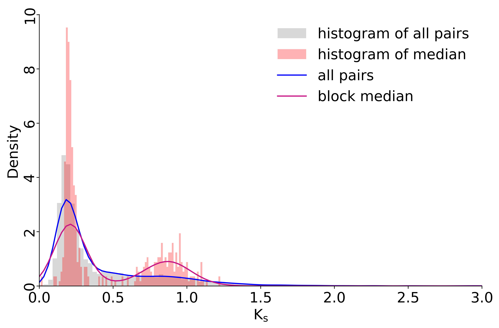
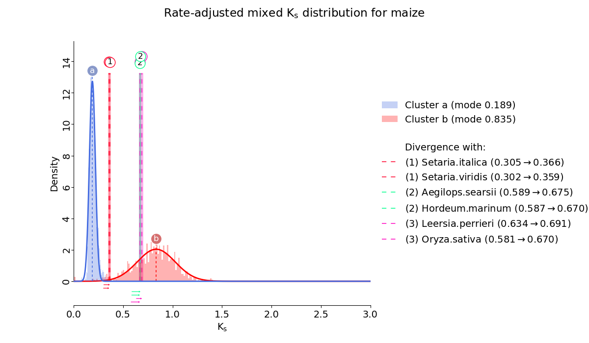

# quota_Anchor&nbsp;&nbsp;[](http://bioconda.github.io/recipes/quota_anchor/README.html)[](https://opensource.org/licenses/MIT)

<div align="center">

[**English**](./README.md) | [**Chinese**](./README_zh.md)

</div>

---
<details open>
 <summary><strong>Table of Contents</strong></summary>

<!-- TOC -->
- [quota\_Anchor  ](#quota_anchor)
  - [Installation](#installation)
  - [Usage](#usage)
    - [Help information](#help-information)
    - [Example of synteny analysis between maize and sorghum](#example-of-synteny-analysis-between-maize-and-sorghum)
      - [Preparation of genome and annotation file](#preparation-of-genome-and-annotation-file)
      - [Generate the longest protein sequence files](#generate-the-longest-protein-sequence-files)
      - [Generate the chromosome length files from fai and gff file](#generate-the-chromosome-length-files-from-fai-and-gff-file)
      - [Generate the table files that will be used as the input file for synteny analysis](#generate-the-table-files-that-will-be-used-as-the-input-file-for-synteny-analysis)
      - [Performing synteny analysis](#performing-synteny-analysis)
      - [Generate the longest cds sequence file](#generate-the-longest-cds-sequence-file)
      - [Calculate synonymous and non-synonymous substitution rates for syntenic pairs](#calculate-synonymous-and-non-synonymous-substitution-rates-for-syntenic-pairs)
    - [Homologous pairs and syntenic pairs visualization](#homologous-pairs-and-syntenic-pairs-visualization)
      - [Dotplot visualiztion](#dotplot-visualiztion)
      - [Circos visualiztion](#circos-visualiztion)
      - [Chromosome line style visualization](#chromosome-line-style-visualization)
  - [Maize gene/gene pairs classification](#maize-genegene-pairs-classification)
  - [Positioning wgd events relative to species divergent events based on ks peaks](#positioning-wgd-events-relative-to-species-divergent-events-based-on-ks-peaks)
<!-- /TOC -->
</details>

Here are the documents to conduct strand and WGD aware syntenic gene identification for a pair of genomes using the longest path algorithm implemented in AnchorWave.
For more information about the algorithm, refer to the [document](./quota_anchor/doc/longestPathAlogorithm.md)

## Installation

You can simply install the software via conda:

```command
conda create -n quota_Anchor bioconda::quota_anchor
```

## Usage

### Help information

```command
quota_Anchor -h
```

```text
usage: quota_Anchor [-h] [-v] {longest_pep,longest_cds,pre_col,col,get_chr_length,dotplot,circle,line,ks,class_gene,kde,kf,trios,correct} ...

Conduct strand and WGD aware syntenic gene identification for a pair of genomes using the longest path usage: quota_Anchor [-h] [-v] {longest_pep,longest_cds,get_chr_length,pre_col,col,ks,dotplot,circle,line,class_gene,kde,kf,trios,correct} ...

Conduct strand and WGD aware syntenic gene identification for a pair of genomes using the longest path algorithm implemented in AnchorWave.

options:
  -h, --help            show this help message and exit
  -v, --version         show program's version number and exit

Gene collinearity analysis:
  {longest_pep,longest_cds,get_chr_length,pre_col,col,ks,dotplot,circle,line,class_gene,kde,kf,trios,correct}
    longest_pep         Call gffread to generate the protein sequence of the species based on the genome and gff files. The longest transcripts are then
                        extracted based on the gff file and the protein sequence file.
    longest_cds         Call gffread to generate the coding sequence of the species based on the genome and gff files. The longest cds are then extracted
                        based on the gff file and the coding sequence file.
    get_chr_length      Generate a length file containing chromosome length and total number of genes based on the fai file and gff file.
    pre_col             Generates the input file for synteny analysis (called a table file or blast file containing gene position information).
    col                 Generate a collinearity file based on the table file.
    ks                  Synonymous/non-synonymous substitution rates for syntenic gene pairs calculated in parallel.
    dotplot             Generate collinear gene pairs dotplot or homologous gene pairs dotplot.
    circle              Collinearity result visualization(circos).
    line                Collinearity result visualization(line style).
    class_gene          Genes or gene pairs are classified into whole genome duplication, tandem duplication, proximal duplication, transposed duplication,
                        and dispersed duplication. For gene classification, there is also a single gene category (singleton) which has no homologous gene.
    kde                 Focal species all syntenic pairs ks / block ks median histogram and gaussian kde curve.
    kf                  Ks fitting plot of the focal species whole genome duplication or ks fitting plot including the corrected ks peaks of species
                        divergence events.
    trios               Generate trios (consist of focal species, sister species, and outgroup species) and species pair files based on the binary newick tree.
    correct             The peak ks of species divergence events were fitted and corrected to the evolutionary rate level of the focal species.
```

### Example of synteny analysis between maize and sorghum

Here is an example to identify syntenic genes between maize and sorghum. The maize lineage has undergone a whole genome duplication (WGD) since its divergence with sorghum, but subsequent chromosomal fusions resulted in these species having the same chromosome number (n = 10). AnchorWave can allow up to two collinear paths for each sorghum anchor while one collinear path for each maize anchor.

#### Preparation of genome and annotation file

The current working directory contains genome files in fasta format and genome annotation files in gff format.

```bash
wget https://download.maizegdb.org/Zm-B73-REFERENCE-NAM-5.0/Zm-B73-REFERENCE-NAM-5.0.fa.gz
wget https://download.maizegdb.org/Zm-B73-REFERENCE-NAM-5.0/Zm-B73-REFERENCE-NAM-5.0_Zm00001eb.1.gff3.gz
wget https://ftp.ensemblgenomes.ebi.ac.uk/pub/plants/release-57/fasta/sorghum_bicolor/dna/Sorghum_bicolor.Sorghum_bicolor_NCBIv3.dna.toplevel.fa.gz
wget https://ftp.ensemblgenomes.ebi.ac.uk/pub/plants/release-57/gff3/sorghum_bicolor/Sorghum_bicolor.Sorghum_bicolor_NCBIv3.57.gff3.gz
gunzip *gz
```

For convenience, rename the file as follows:

```text
├── maize.fa
├── maize.gff3
├── sorghum.fa
└── sorghum.gff3
```

#### Generate the longest protein sequence files

The process, implemented in the `quota_Anchor longest_pep` module, consists of two main steps:

1. Protein sequences are extracted from genomes and annotation files based on genetic code tables.
2. For each gene, the longest protein sequence was identified and extracted to ensure the most complete characterization for further analysis.

```command
quota_Anchor longest_pep -f sorghum.fa,maize.fa -g sorghum.gff3,maize.gff3 -p sb.p.fa,zm.p.fa -l sorghum.protein.fa,maize.protein.fa -t 2 --overwrite -merge merged.pep.fa
```

#### Generate the chromosome length files from fai and gff file

The length files are required as input for generating table files, which are subsequently used for synteny analysis and plotting.

```command
quota_Anchor get_chr_length -f sorghum.fa.fai,maize.fa.fai -g sorghum.gff3,maize.gff3 -s 0-9:chr -o sorghum.length.txt,maize.length.txt --overwrite
```

#### Generate the table files that will be used as the input file for synteny analysis

1. Use DIAMOND/BLASTP/BLASTN for sequence alignment.
2. Combine the BLAST results and GFF file information into a single table file.

```command
quota_Anchor pre_col -a diamond -rs sorghum.protein.fa -qs maize.protein.fa -db sorghum.database.diamond -mts 20 -e 1e-10 -b sorghum.maize.diamond -rg sorghum.gff3 -qg maize.gff3 -o sb_zm.table -bs 100 -al 0 -rl sorghum.length.txt -ql maize.length.txt --overwrite
```

#### Performing synteny analysis

1. Generate collinearity result and specify `-r -q` parameter.

    ```command
    quota_Anchor col -i sb_zm.table -o sb_zm.collinearity -r 2 -q 1 -s 0 --overwrite 
    ```

2. Get `all` collinearity result and `remove` relative inversion gene pairs.

    ```command
    quota_Anchor col -i sb_zm.table -o sb_zm.collinearity -s 1 -a 1 --overwrite
    ```

3. Get `all` collinearity result and `retain` relative inversion gene pairs.

    ```command
    quota_Anchor col -i sb_zm.table -o sb_zm.collinearity -s 0 -a 1 --overwrite
    ```

#### Generate the longest cds sequence file

The process, implemented in the `quota_Anchor longest_cds` module, consists of two main steps:

1. Extract cds sequences from genome files and annotation files.
2. Identify and extract the longest CDS sequence for each gene.

```command
quota_Anchor longest_cds -f sorghum.fa,maize.fa -g sorghum.gff3,maize.gff3 -p sb.cds.fa,zm.cds.fa -l sorghum.cds.fa,maize.cds.fa -t 2 --overwrite -merge merged.cds.fa
```

#### Calculate synonymous and non-synonymous substitution rates for syntenic pairs

```command
quota_Anchor ks -i sb_zm.collinearity -a muscle -p merged.pep.fa -d merged.cds.fa  -o sb_zm.ks -t 16 --overwrite 
```

### Homologous pairs and syntenic pairs visualization

#### Dotplot visualiztion

1. Homologous gene pairs visualization using identity as a legend.

    ```command
    quota_Anchor dotplot -i sb_zm.table  -o sb_zm.table.identity.png -r sorghum.length.txt -q maize.length.txt -t order -r_label "Sorghum bicolor" -q_label "Zea mays" -w 1500 -e 1200 -use_identity --overwrite 
    ```

    <p align="center">
    
    </p>

2. Syntenic pairs visualization using identity as a legend.

    ```command
    quota_Anchor dotplot -i sb_zm.collinearity  -o sb_zm.collinearity.identity.png -r sorghum.length.txt -q maize.length.txt -t order -r_label "Sorghum bicolor" -q_label "Zea mays" -w 1500 -e 1200 -use_identity --overwrite
    ```

    <p align="center">
    
    </p>

3. Syntenic pairs visualization using ks value as a legend.

    ```command
    quota_Anchor dotplot -i sb_zm.collinearity  -o sb_zm.collinearity.ks.png -r sorghum.length.txt -q maize.length.txt -t order -r_label "Sorghum bicolor" -q_label "Zea mays" -w 1500 -e 1200 -ks sb_zm.ks --overwrite
    ```

    <p align="center">
    
    </p>

#### Circos visualiztion

Inter-species

```command
quota_Anchor circle -i sb_zm.collinearity -o sb_zm.circle.png -q maize.length.txt -r sorghum.length.txt -rn "Sorghum bicolor" -qn "Zea mays" -cf 9 -sf 9 -rm chr,Chr -fs 14,14 --overwrite
```

<p align="center">

</p>

Intra-species

```command
quota_Anchor circle -i sb_sb.collinearity -o sb_sb.circle.png --overwrite -r ../sorghum.length.txt -q ../sorghum.length.txt -rn "sorghum" -qn "sorghum" 
```

<p align="center">

</p>

#### Chromosome line style visualization

1. Visualization of syntenic pairs of two species
  
    ```command
    quota_Anchor line -i sb_zm.collinearity -o sb_zm.line.png -l sorghum.length.txt,maize.length.txt -n "Sorghum bicolor,Zea mays" --overwrite  
    ```

    <p align="center">
    
    </p>

2. Multi-species syntenic pairs visualization

    ```command
    quota_Anchor line -i os_sb.collinearity,sb_sv.collinearity -o os_sb_sv.line.png -l os.length.txt,sb.length.txt,sv.length.txt -n "Oryza sativa, Sorghum bicolor,Zea mays" -rm "chr,Chr" -cf 7 -sf 10 -fs 14,14 --overwrite
    ```

    <p align="center">
    
    </p>

## Maize gene/gene pairs classification

This pipeline refers to [DupGen_finder](https://github.com/qiao-xin/DupGen_finder), with some modifications to suit our specific requirements. In summary, the partitioning conditions in non-unique mode are more relaxed, whereas the conditions in unique mode are more stringent.

1. Synteny Analysis of Maize and Maize

    ```command
    quota_Anchor pre_col -a diamond -rs maize.protein.fa -qs maize.protein.fa -db maize.database.diamond -mts 20 -e 1e-10 -b maize.maize.diamond -rg maize.gff3 -qg maize.gff3 -o zm_zm.table -bs 100 -al 0 -rl maize.length.txt -ql maize.length.txt --overwrite
    quota_Anchor col -i zm_zm.table -o zm_zm.collinearity -s 0 -m 500 -W 5 -E -0.005 -D 25 -a 1 --overwrite
    ```

2. Download Musa balbisiana data and rename the filename

    ```bash
    wget https://api.ncbi.nlm.nih.gov/datasets/v2/genome/accession/GCA_004837865.1/download\?include_annotation_type\=GENOME_FASTA\&include_annotation_type\=GENOME_GFF
    ```

    ```text
    ├── banana.B.fa
    └── banana.B.gff
    ```

3. Synteny Analysis of Banana.B and Maize

    ```command
    quota_Anchor longest_pep -f banana.B.fa -g banana.B.gff -p B.p.pep -l banana.B.pep -t 1 --overwrite
    quota_Anchor get_chr_length -f banana.B.fa.fai -g banana.B.gff -s CM01 -o banana.B.length.txt --overwrite
    quota_Anchor pre_col -a diamond -rs banana.B.pep -qs maize.protein.fa -db banana.B.database.diamond -mts 20 -e 1e-10 -b banana.B.maize.diamond -rg banana.B.gff -qg maize.gff3 -o bananaB_zm.table -bs 100 -al 0 -rl banana.B.length.txt -ql maize.length.txt --overwrite
    quota_Anchor col -i bananaB_zm.table -o bananaB_zm.collinearity -s 0 --overwrite -D 25 -a 1 
    ```

4. Classifying maize genes/gene pairs
    Unique mode

    ```command
    quota_Anchor class_gene -b maize.maize.diamond -g maize.gff3 -q zm_zm.collinearity -qr bananaB_zm.collinearity -o maize_classify_dir -p maize -s 1 -d 10 --overwrite -u
    ```

    <p align="center">
    
    </p>

    <p align="center">
    
    </p>

    Non-unique mode

    ```command
    quota_Anchor class_gene -b maize.maize.diamond -g maize.gff3 -q zm_zm.collinearity -qr bananaB_zm.collinearity -o maize_classify_dir -p maize -s 1 -d 10 --overwrite
    ```

    <p align="center">
    
    </p>

    <p align="center">
    
    </p>

## Positioning wgd events relative to species divergent events based on ks peaks

This pipeline refers to [ksrates](https://github.com/VIB-PSB/ksrates), with some differences between the two. In short, this pipeline uses the collinear gene pair ks value fitting results obtained based on the `-r_value -q_value` parameters as the species divergent peak, while ksrates uses the RBH gene pair ks value fitting results as the species divergent peak.
The following is the current directory tree.

```text
├── raw_data
│   ├── maize.fa
│   ├── maize.gff3
│   ├── oryza.fa
│   ├── oryza.gff3
│   ├── setaria.fa
│   ├── setaria.gff3
│   ├── sorghum.fa
│   └── sorghum.gff3
└── scripts
    ├── ks_pipeline.py
    └── longest_pipeline.py
```

1. Generate longest protein and longest cds sequence for each species in the input directory.

    ```command
    python ./scripts/longest_pipeline.py -i raw_data -o output_dir --overwrite
    ```

2. Get species chromosome length file.
   You may need to run `quota_Anchor get_chr_length` to understand the meaning of the `-s` parameter.

    a)

    ```bash
    find ./raw_data/*fai |awk '{printf "%s,", $1}'
    find ./raw_data/*gff3 |awk '{printf "%s,", $1}'
    find ./raw_data/*gff3 |awk '{printf "%s,", $1}'|sed s/gff3/length\.txt/g   
    ```

    ```command
    quota_Anchor get_chr_length -f ./raw_data/maize.fa.fai,./raw_data/oryza.fa.fai,./raw_data/setaria.fa.fai,./raw_data/sorghum.fa.fai -g ./raw_data/maize.gff3,./raw_data/oryza.gff3,./raw_data/setaria.gff3,./raw_data/sorghum.gff3 -s 0-9,CHR,chr,Chr:0-9,CHR,chr,Chr:0-9,CHR,chr,Chr:0-9,CHR,chr,Chr -o ./raw_data/maize.length.txt,./raw_data/oryza.length.txt,./raw_data/setaria.length.txt,./raw_data/sorghum.length.txt --overwrite
    ```

    b)

    ```command
    quota_Anchor get_chr_length -f "$(find ./raw_data/*fai |awk '{printf "%s,", $1}')" -g "$(find ./raw_data/*gff3 |awk '{printf "%s,", $1}')" -s 0-9,CHR,chr,Chr:0-9,CHR,chr,Chr:0-9,CHR,chr,Chr:0-9,CHR,chr,Chr -o "$(find ./raw_data/*gff3 |awk '{printf "%s,", $1}'|sed s/gff3/length\.txt/g)" --overwrite
    ```

3. According to binary newick tree get trios file and species pair file.

    ```command
    quota_Anchor trios -n "(((maize, sorghum), setaria), oryza);" -k "maize" -ot ortholog_trios_maize.csv -op species_pairs.csv -t tree.txt --overwrite
    ```

    <table>
    <tr>
            <td width="15%" align =center>Species_1</td>
            <td width="15%" align =center>Species_2</td>
            <td width="10%" align =center>q_value</td>
            <td width="10%" align =center>r_value</td>
            <td width="20%" align =center>get_all_collinear_pairs</td>
        </tr>
    <tr>
            <td width="15%" align =center>maize</td>
            <td width="15%" align =center>setaria</td>
            <td width="10%" align =center>1</td>
            <td width="10%" align =center>1</td>
            <td width="20%" align =center>0</td>
        </tr>
    <tr>
            <td width="15%" align =center>maize</td>
            <td width="15%" align =center>setaria</td>
            <td width="10%" align =center>1</td>
            <td width="10%" align =center>1</td>
            <td width="20%" align =center>0</td>
        </tr>
    <tr>
            <td width="15%" align =center>sorghum</td>
            <td width="15%" align =center>setaria</td>
            <td width="10%" align =center>1</td>
            <td width="10%" align =center>1</td>
            <td width="20%" align =center>0</td>
        </tr>
    <tr>
            <td width="15%" align =center>maize</td>
            <td width="15%" align =center>oryza</td>
            <td width="10%" align =center>1</td>
            <td width="10%" align =center>1</td>
            <td width="20%" align =center>0</td>
        </tr>
    <tr>
            <td width="15%" align =center>sorghum</td>
            <td width="15%" align =center>oryza</td>
            <td width="10%" align =center>1</td>
            <td width="10%" align =center>1</td>
            <td width="20%" align =center>0</td>
        </tr>
    <tr>
            <td width="15%" align =center>setaria</td>
            <td width="15%" align =center>oryza</td>
            <td width="10%" align =center>1</td>
            <td width="10%" align =center>1</td>
            <td width="20%" align =center>0</td>
        </tr>
    </table>

4. Get synteny file and ks file for each species pair.
    Note:
    1. The `./scripts/ks_pipeline.py` script uses the `Species_1` column as the query and the `Species_2` column as the reference in the collinearity procedure.
    2. The `./scripts/ks_pipeline.py` script adjusts the parameters of the collinearity procedure based on the `r_value` `q_value` and `get_all_collinear_pairs` columns of the species pairs file.
    3. You may need to understand the meaning of the `r_value`, `q_value` and `get_all_collinear_pairs` parameter via `quota_Anchor col` command.

    ```command
    python ./scripts/ks_pipeline.py -i raw_data -o output_dir -s species_pairs.csv -a diamond -l raw_data --overwrite -plot_table       
    ```

5. Ks fitting and correction for each species ks divergent peak.
    Note:
    1. The `0` in `find ./output_dir/02synteny/*0.ks |awk '{printf "%s,", $1}'` represents the value of the `get_all_collinear_pairs` column of the species pair file.

    ```bash
    find ./output_dir/02synteny/*0.ks |awk '{printf "%s,", $1}'
    ```

   ```command
    quota_Anchor correct -k "./output_dir/02synteny/maize_oryza0.ks,./output_dir/02synteny/maize_setaria0.ks,./output_dir/02synteny/maize_sorghum0.ks,./output_dir/02synteny/setaria_oryza0.ks,./output_dir/02synteny/sorghum_oryza0.ks,./output_dir/02synteny/sorghum_setaria0.ks" -s species_pairs.csv -t ortholog_trios_maize.csv -kr 0,1 -ot outfile_divergent_peaks.csv --overwrite
   ```

6. Maize wgd ks peaks fitting

    ```command
    quota_Anchor pre_col -a diamond -rs ./output_dir/01longest/maize.longest.pep -qs ./output_dir/01longest/maize.longest.pep -db ./maize/maize.database.diamond -mts 20 -e 1e-10 -b ./maize/maize.maize.diamond -rg ./raw_data/maize.gff3 -qg ./raw_data/maize.gff3 -o ./maize/zm_zm.table -bs 100 -al 0 --overwrite

    quota_Anchor dotplot -i ./maize/zm_zm.table -o ./maize/zm.zm.png -r ./raw_data/maize.length.txt -q ./raw_data/maize.length.txt -r_label maize -q_label maize -use_identity --overwrite

    quota_Anchor col -i ./maize/zm_zm.table -o ./maize/zm_zm.collinearity -a 1 -m 1000 -W 1 -D 25 -I 5 -E -0.01 -f 0 --overwrite

    quota_Anchor dotplot -i ./maize/zm_zm.collinearity -o ./maize/zm.zm.collinearity.png -r ./raw_data/maize.length.txt -q ./raw_data/maize.length.txt -r_label maize -q_label maize -use_identity --overwrite

    quota_Anchor ks -i ./maize/zm_zm.collinearity -a mafft -p ./output_dir/01longest/maize.longest.pep -d ./output_dir/01longest/maize.longest.cds -o ./maize/zm.zm.ks -t 16  --overwrite  

    quota_Anchor dotplot -i ./maize/zm_zm.collinearity -o ./maize/zm.zm.collinearity.ks.png -r ./raw_data/maize.length.txt -q ./raw_data/maize.length.txt -r_label maize -q_label maize --overwrite -ks ./maize/zm.zm.ks
    ```

    ```command
    quota_Anchor kde -i ./maize/zm_zm.collinearity -r./raw_data/maize.length.txt -q ./raw_data/maize.length.txt -o ./maize/zm.zm.kde.png -k ./maize/zm.zm.ks --overwrite
    ```

    <p align="center">
    
    </p>

    ```command
    quota_Anchor kf -i ./maize/zm_zm.collinearity -r./raw_data/maize.length.txt -q ./raw_data/maize.length.txt -o ./maize/zm.zm.kf.png -k ./maize/zm.zm.ks -f maize -components 2 -kr 0,2 --overwrite
    ```

    <p align="center">
    
    </p>
7. The kernel density of the maize genome duplication event ks was estimated and fitted using a Gaussian approximation function, and the ks peak of the corrected species divergent events was plotted.

    ```command
    quota_Anchor kf -i ./maize/zm_zm.collinearity -r ./raw_data/maize.length.txt -q ./raw_data/maize.length.txt -o ./maize/zm.zm.png -k ./maize/zm.zm.ks -components 2 -f maize -correct_file outfile_divergent_peaks.csv -kr 0,2 --overwrite
    ```

    <p align="center">
    
    </p>
