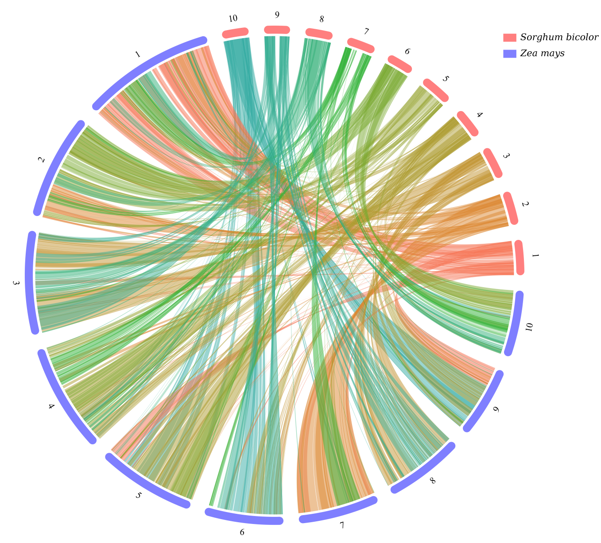
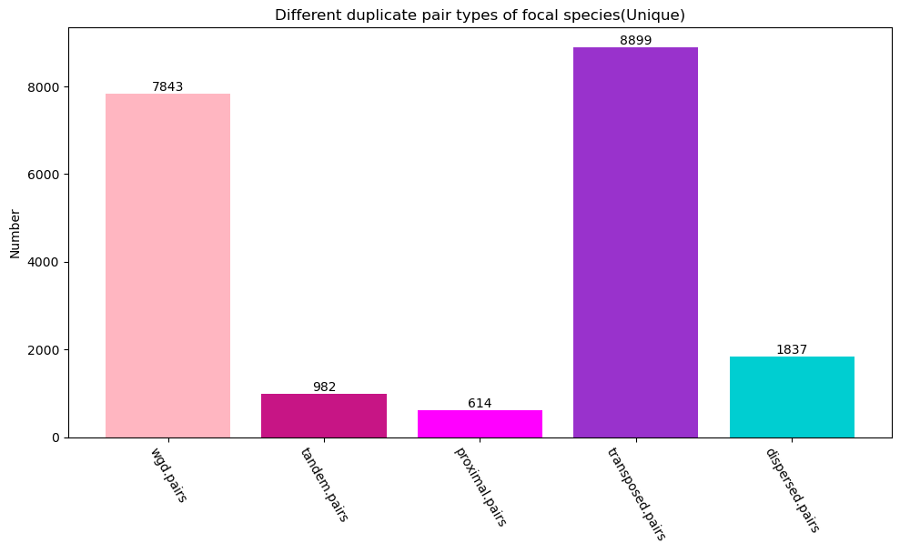

# quota_Anchor&nbsp;&nbsp;[](http://bioconda.github.io/recipes/quota_anchor/README.html)[](https://opensource.org/licenses/MIT)

<div align="center">

[**English**](./README.md) | [**中文简体**](./README_zh.md)

</div>

---
<details open>
 <summary><strong>Table of Contents</strong></summary>

<!-- TOC -->
- [quota\_Anchor  ](#quota_anchor)
  - [Installation](#installation)
  - [使用方法](#使用方法)
    - [帮助信息](#帮助信息)
  - [玉米和高粱间共线性分析示例](#玉米和高粱间共线性分析示例)
    - [基因组和注释文件的准备](#基因组和注释文件的准备)
    - [产生每个基因的最长转录本](#产生每个基因的最长转录本)
    - [产生染色体长度文件](#产生染色体长度文件)
    - [生成共线性分析的输入文件](#生成共线性分析的输入文件)
    - [进行基因共线性分析](#进行基因共线性分析)
    - [产生每个基因的最长编码序列](#产生每个基因的最长编码序列)
    - [共线性基因对和非共线性基因对同义和非同义替换率的计算](#共线性基因对和非共线性基因对同义和非同义替换率的计算)
  - [同源基因对和共线性基因对可视化](#同源基因对和共线性基因对可视化)
    - [点图可视化](#点图可视化)
    - [物种内或者物种间圈图可视化](#物种内或者物种间圈图可视化)
    - [共线性基因对线形风格染色体可视化](#共线性基因对线形风格染色体可视化)
    - [Maize gene/gene pairs classification](#maize-genegene-pairs-classification)
<!-- /TOC -->
</details>
以下是使用最长路径算法考虑基因方向和全基因组复制信息来识别一对基因组共线性基因的文档。

## Installation

你可以简单地通过conda安装这个软件:

```command
conda create -n quota_Anchor bioconda::quota_anchor
```

## 使用方法

### 帮助信息

```command
quota_Anchor -h
```

```text
用法: quota_Anchor [-h] [-v] {longest_pep,longest_cds,pre_col,col,get_chr_length,dotplot,circle,line,line_proali,ks,class_gene,kde,kf,trios,correct} ...

使用AnchorWave中实现的最长路径算法考虑基因方向和全基因组复制信息识别对一对基因组的共线性基因

选项:
  -h, --help            显示帮助信息然后退出。
  -v, --version         显示版本信息然后退出。

基因共线性分析:
  {longest_pep,longest_cds,pre_col,col,get_chr_length,dotplot,circle,line,line_proali,ks,class_gene,kde,kf,trios,correct}
    longest_pep         根据gffread产生的蛋白质序列和GFF文件提取最长转录本。
    longest_cds         根据gffread产生的编码序列和GFF文件提取最长编码序列(CDS)。
    pre_col             产生共线性分析所需的输入文件(表文件)。
    col                 产生共线性文件。
    get_chr_length      根据fai文件和GFF文件产生包含染色体长度和基因总数信息的长度文件。
    dotplot             得到共线性基因对点图和同源基因对点图。
    circle              共线性结果可视化圈图。
    line                共线性结果可视化线形图。
    line_proali         AnchorWave产生的anchors文件线形可视化。
    ks                  共线性基因对的同义和非同义替换率的计算。
    class_gene          将基因或者基因对分类为全基因组复制重复、串联重复、近端重复、转座子重复以及离散重复，对于基因分类来说还有单基因类别(singleton)。
    kde                 所关注的物种的 所有共线性基因对的ks/共线性区块中位数ks 柱形图和高斯核密度评估曲线。
    kf                  ks峰值拟合图。
    trios               根据nwk树文件产生trios，也就是产生焦点物种、姊妹物种以及外群物种组成的三元组。
    correct             产生并矫正物种分化事件ks峰值。
```

## 玉米和高粱间共线性分析示例

自从玉米与高粱分化以来，玉米相对高粱多经历了一次全基因组复制， 但随后的染色体融合导致这两个物种的染色体数目相同(n = 10)。AnchorWave 可以最多可为每个高粱锚点提供两条共线性路径，而为每个玉米锚点提供一条共线性路径。

### 基因组和注释文件的准备

当前工作目录包含 fasta 格式的基因组文件和 gff 格式的基因组注释文件。

```bash
wget https://download.maizegdb.org/Zm-B73-REFERENCE-NAM-5.0/Zm-B73-REFERENCE-NAM-5.0.fa.gz
wget https://download.maizegdb.org/Zm-B73-REFERENCE-NAM-5.0/Zm-B73-REFERENCE-NAM-5.0_Zm00001eb.1.gff3.gz
wget https://ftp.ensemblgenomes.ebi.ac.uk/pub/plants/release-57/fasta/sorghum_bicolor/dna/Sorghum_bicolor.Sorghum_bicolor_NCBIv3.dna.toplevel.fa.gz
wget https://ftp.ensemblgenomes.ebi.ac.uk/pub/plants/release-57/gff3/sorghum_bicolor/Sorghum_bicolor.Sorghum_bicolor_NCBIv3.57.gff3.gz
gunzip *gz
```

方便起见，将文件重命令如下。

```text
├── maize.fa
├── maize.gff3
├── sorghum.fa
└── sorghum.gff3
```

### 产生每个基因的最长转录本

该过程主要包括两个步骤：

1. 基于遗传密码表，从基因组文件和注释文件中提取蛋白质序列（调用gffread）。
2. 对于每个基因，提取其最长转录本。

```command
quota_Anchor longest_pep -f sorghum.fa,maize.fa -g sorghum.gff3,maize.gff3 -p sb.p.fa,zm.p.fa -l sorghum.protein.fa,maize.protein.fa -t 2 --overwrite -merge merged.pep.fa
```

### 产生染色体长度文件

染色体长度文件除了记录了染色体名字外还记录了染色体长度和基因总数信息，随后可用于共线性分析和绘图。

```command
quota_Anchor get_chr_length -f sorghum.fa.fai,maize.fa.fai -g sorghum.gff3,maize.gff3 -s 0-9:chr -o sorghum.length.txt,maize.length.txt --overwrite
```

### 生成共线性分析的输入文件

1. 使用 DIAMOND/BLASTP/BLASTN 进行蛋白或者cds序列局部比对。
2. 将 BLAST 结果和 GFF 文件信息整合到一个表格文件中。

```command
quota_Anchor pre_col -a diamond -rs sorghum.protein.fa -qs maize.protein.fa -db sorghum.database.diamond -mts 20 -e 1e-10 -b sorghum.maize.diamond -rg sorghum.gff3 -qg maize.gff3 -o sb_zm.table -bs 100 -al 0 -rl sorghum.length.txt -ql maize.length.txt --overwrite
```

### 进行基因共线性分析

1. 通过指定 `-r -q` 参数， 生成共线性结果.

    ```command
    quota_Anchor col -i sb_zm.table -o sb_zm.collinearity -r 2 -q 1 -s 0 --overwrite 
    ```

2. `移除`相对倒位基因对，生成`所有`共线性结果（不指定`-r -q`）。

    ```command
    quota_Anchor col -i sb_zm.table -o sb_zm.collinearity -s 1 -a 1 --overwrite
    ```

3. `保留`相对倒位基因对, 生成`所有`共线性结果（不指定`-r -q`）。

    ```command
    quota_Anchor col -i sb_zm.table -o sb_zm.collinearity -s 0 -a 1 --overwrite
    ```

### 产生每个基因的最长编码序列

该过程主要包括两个步骤：

1. 从基因组文件和注释文件中提取编码序列（调用gffread）。
2. 对于每个基因，提取其最长编码序列。

```command
quota_Anchor longest_cds -f sorghum.fa,maize.fa -g sorghum.gff3,maize.gff3 -p sb.cds.fa,zm.cds.fa -l sorghum.cds.fa,maize.cds.fa -t 2 --overwrite -merge merged.cds.fa
```

### 共线性基因对和非共线性基因对同义和非同义替换率的计算

```command
quota_Anchor ks -i sb_zm.collinearity -a muscle -p merged.pep.fa -d merged.cds.fa  -o sb_zm.ks -t 16 --overwrite 
```

## 同源基因对和共线性基因对可视化

### 点图可视化

1. 同源基因对可视化，使用identity作为图例。

    ```command
    quota_Anchor dotplot -i sb_zm.table  -o sb_zm.table.identity.png -r sorghum.length.txt -q maize.length.txt -t order -r_label "Sorghum bicolor" -q_label "Zea mays" -w 1500 -e 1200 -use_identity --overwrite 
    ```

    <p align="center">
    
    </p>

2. 共线性基因对可视化，使用identity作为图例。

    ```command
    quota_Anchor dotplot -i sb_zm.collinearity  -o sb_zm.collinearity.identity.png -r sorghum.length.txt -q maize.length.txt -t order -r_label "Sorghum bicolor" -q_label "Zea mays" -w 1500 -e 1200 -use_identity --overwrite
    ```

    <p align="center">
    
    </p>

3. 共线性基因对可视化，使用ks值作为图例。

    ```command
    quota_Anchor dotplot -i sb_zm.collinearity  -o sb_zm.collinearity.ks.png -r sorghum.length.txt -q maize.length.txt -t order -r_label "Sorghum bicolor" -q_label "Zea mays" -w 1500 -e 1200 -ks sb_zm.ks --overwrite
    ```

    <p align="center">
    
    </p>

4. R语言共线性基因对点图可视化。

    This file of `sb_zm.collinearity` could be visualized via the following R code:

    ```R
    library(ggplot2)
    changetoM <- function ( position ){
      position=position/1000000;
      paste(position, "M", sep="")
    }

    data = read.table("sb_zm.collinearity", header=T)
    data = data[which(data$refChr %in% c("1", "2", "3", "4", "5", "6", "7", "8", "9", "10")),]
    data = data[which(data$queryChr %in% c("chr1", "chr2", "chr3", "chr4", "chr5", "chr6", "chr7", "chr8", "chr9", "chr10")),]
    data$refChr = factor(data$refChr, levels=c("1", "2", "3", "4", "5", "6", "7", "8", "9", "10"))
    data$queryChr = factor(data$queryChr, levels=c("chr1", "chr2", "chr3", "chr4", "chr5", "chr6", "chr7", "chr8", "chr9", "chr10"))

    plot = ggplot(data=data, aes(x=queryStart, y=referenceStart))+geom_point(size=0.5, aes(color=strand))+facet_grid(refChr~queryChr, scales="free", space="free" )+ 
      theme_grey(base_size = 30) +
      labs(x="maize", y="sorghum")+scale_x_continuous(labels=changetoM) + scale_y_continuous(labels=changetoM) +
      theme(axis.line = element_blank(),
            panel.background = element_blank(),
            panel.border = element_rect(fill=NA,color="black", linewidth=0.5, linetype="solid"),
            axis.text.y = element_text( colour = "black"),
            legend.position='none',
            axis.text.x = element_text(angle=300, hjust=0, vjust=1, colour = "black") )

    png("sorghum.maize.colinearity.png" , width=2000, height=1500)
    plot
    dev.off()
    ```

    <p align="center">
    
    </p>

### 物种内或者物种间圈图可视化

玉米和高粱物种间

```command
quota_Anchor circle -i sb_zm.collinearity -o sb_zm.circle.png -q maize.length.txt -r sorghum.length.txt -rn "Sorghum bicolor" -qn "Zea mays" -cf 9 -sf 9 -rm chr,Chr -fs 14,14 --overwrite
```

<p align="center">

</p>

高粱物种内

```command
quota_Anchor circle -i sb_sb.collinearity -o sb_sb.circle.png --overwrite -r ../sorghum.length.txt -q ../sorghum.length.txt -rn "sorghum" -qn "sorghum" 
```

<p align="center">

</p>

### 共线性基因对线形风格染色体可视化

1. 两物种共线性基因对可视化
  
    ```command
    quota_Anchor line -i sb_zm.collinearity -o sb_zm.line.png -l sorghum.length.txt,maize.length.txt -n "Sorghum bicolor,Zea mays" --overwrite  
    ```

    <p align="center">
    
    </p>

2. 三个物种共线性基因对可视化(两次两两比较)

    ```command
    quota_Anchor line -i os_sb.collinearity,sb_sv.collinearity -o os_sb_sv.line.png -l os.length.txt,sb.length.txt,sv.length.txt -n "Oryza sativa, Sorghum bicolor,Zea mays" -rm "chr,Chr" -cf 7 -sf 10 -fs 14,14 --overwrite
    ```

    <p align="center">
    
    </p>

### Maize gene/gene pairs classification

1. 玉米和玉米的共线性分析

    ```command
    quota_Anchor pre_col -a diamond -rs maize.protein.fa -qs maize.protein.fa -db maize.database.diamond -mts 20 -e 1e-10 -b maize.maize.diamond -rg maize.gff3 -qg maize.gff3 -o zm_zm.table -bs 100 -al 0 -rl maize.length.txt -ql maize.length.txt --overwrite
    quota_Anchor col -i zm_zm.table -o zm_zm.collinearity -s 0 -m 500 -W 5 -E -0.005 -D 25 -a 1 --overwrite
    ```

2. 下载Musa balbisiana基因组文件和注释文件并重命名

    ```bash
    wget https://api.ncbi.nlm.nih.gov/datasets/v2/genome/accession/GCA_004837865.1/download\?include_annotation_type\=GENOME_FASTA\&include_annotation_type\=GENOME_GFF
    ```

    ```text
    ├── banana.B.fa
    └── banana.B.gff
    ```

3. 野蕉和玉米的共线性分析

    ```command
    quota_Anchor longest_pep -f banana.B.fa -g banana.B.gff -p B.p.pep -l banana.B.pep -t 1 --overwrite
    quota_Anchor get_chr_length -f banana.B.fa.fai -g banana.B.gff -s CM01 -o banana.B.length.txt --overwrite
    quota_Anchor pre_col -a diamond -rs banana.B.pep -qs maize.protein.fa -db banana.B.database.diamond -mts 20 -e 1e-10 -b banana.B.maize.diamond -rg banana.B.gff -qg maize.gff3 -o bananaB_zm.table -bs 100 -al 0 -rl banana.B.length.txt -ql maize.length.txt --overwrite
    quota_Anchor col -i bananaB_zm.table -o bananaB_zm.collinearity -s 0 --overwrite -D 25 -a 1 
    ```

4. 玉米基因及同源基因对的划分
    Unique模式

    ```command
    quota_Anchor class_gene -b maize.maize.diamond -g maize.gff3 -q zm_zm.collinearity -qr bananaB_zm.collinearity -o maize_classify_dir -p maize -s 1 -d 10 --overwrite -u
    ```

    <p align="center">
    
    </p>

    <p align="center">
    
    </p>

    Non-unique模式

    ```command
    quota_Anchor class_gene -b maize.maize.diamond -g maize.gff3 -q zm_zm.collinearity -qr bananaB_zm.collinearity -o maize_classify_dir -p maize -s 1 -d 10 --overwrite
    ```

    <p align="center">
    
    </p>

    <p align="center">
    
    </p>
