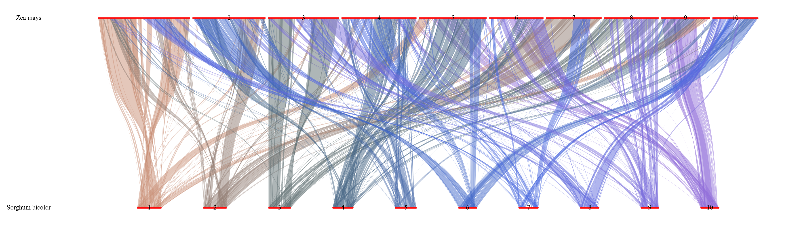
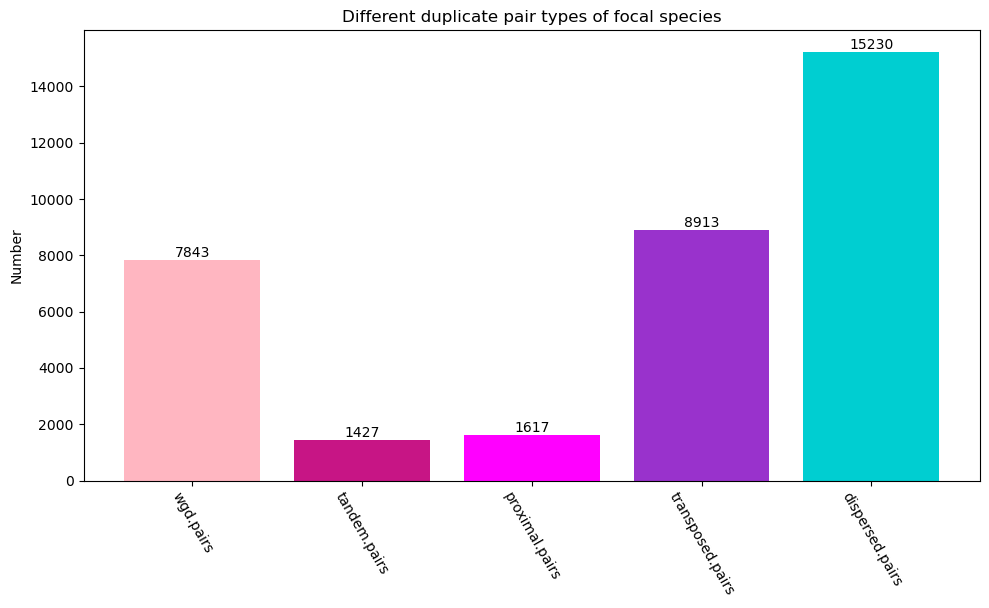

# quota_Anchor&nbsp;&nbsp;[](http://bioconda.github.io/recipes/quota_anchor/README.html)[](https://opensource.org/licenses/MIT)

<div align="center">

[**English**](./) | [**中文简体**](./README_zh.md)

</div>

---
<details open>
 <summary><strong>目录</strong></summary>

<!-- TOC -->
- [quota\_Anchor  ](#quota_anchor)
  - [安装](#安装)
  - [使用方法](#使用方法)
    - [帮助信息](#帮助信息)
  - [玉米和高粱间共线性分析示例](#玉米和高粱间共线性分析示例)
    - [基因组和注释文件的准备](#基因组和注释文件的准备)
    - [产生每个基因的最长转录本](#产生每个基因的最长转录本)
    - [产生物种染色体长度文件](#产生物种染色体长度文件)
    - [生成共线性分析的输入文件](#生成共线性分析的输入文件)
    - [进行基因共线性分析](#进行基因共线性分析)
    - [产生每个基因的最长编码序列](#产生每个基因的最长编码序列)
    - [并行计算共线性基因对的同义和非同义替换率](#并行计算共线性基因对的同义和非同义替换率)
  - [同源基因对和共线性基因对可视化](#同源基因对和共线性基因对可视化)
    - [点图可视化](#点图可视化)
    - [物种内或者物种间圈图可视化](#物种内或者物种间圈图可视化)
    - [共线性基因对线形风格染色体可视化](#共线性基因对线形风格染色体可视化)
  - [玉米基因和基因对的分类](#玉米基因和基因对的分类)
  - [基于同义替换率相对于物种分化事件定位全基因组复制事件](#基于同义替换率相对于物种分化事件定位全基因组复制事件)
  - [常见问题](#常见问题)
<!-- /TOC -->
</details>
以下是使用最长路径算法考虑基因方向和全基因组复制信息来识别一对基因组共线性基因的文档。

## 安装

你可以简单地通过conda安装这个软件:

```command
conda create -n quota_Anchor bioconda::quota_anchor
```

## 使用方法

### 帮助信息

```command
quota_Anchor -h
```

```text
用法: quota_Anchor [-h] [-v] {longest_pep,longest_cds,pre_col,col,get_chr_length,dotplot,circle,line,ks,class_gene,kde,kf,trios,correct} ...

使用AnchorWave中实现的最长路径算法并考虑基因方向和全基因组复制信息来识别对一对基因组的共线性基因

选项:
  -h, --help            显示帮助信息然后退出。
  -v, --version         显示版本信息然后退出。

基因共线性分析:
  {longest_pep,longest_cds,pre_col,col,get_chr_length,dotplot,circle,line,ks,class_gene,kde,kf,trios,correct}
    longest_pep         基于基因组文件和GFF文件调用gffread生成物种蛋白质序列，接着结合GFF文件提取其最长转录本。
    longest_cds         基于基因组文件和GFF文件调用gffread产生物种的基因编码序列，接着结合GFF文件提取其最长编码序列。
    pre_col             基于染色体长度文件和blast文件产生共线性分析所需的输入文件(称为表文件或包含基因位置信息的blast文件)。
    col                 基于表文件生成共线性文件。
    get_chr_length      根据fai文件和GFF文件产生包含染色体长度和基因总数信息的长度文件。
    dotplot             产生共线性基因对点图和同源基因对点图。
    circle              共线性结果可视化(圈图)。
    line                共线性结果可视化(线形图)。
    ks                  并行计算共线性基因对的同义和非同义替换率。
    class_gene          将基因或者基因对分类为全基因组复制重复、串联重复、近端重复、转座子重复以及离散重复，对于基因分类来说还有不存在同源基因的单基因类别(singleton)。
    kde                 焦点物种 所有共线性基因对ks/共线性区块中位数ks 的柱形图和高斯核密度评估曲线。
    kf                  对玉米全基因组复制事件ks进行核密度评估及高斯近似函数拟合并绘图或结合纠正后的物种分化ks峰值绘图。
    trios               根据newick格式的二叉树产生trios(焦点物种、姊妹物种以及外群物种组成的三元组)和物种对文件。
    correct             拟合物种分化事件的ks峰值并将其矫正到焦点物种的进化速率水平上。
```

## 玉米和高粱间共线性分析示例

自从玉米与高粱分化以来，玉米相对高粱多经历了一次全基因组复制， 但随后的染色体融合导致这两个物种的染色体数目相同(n = 10)。AnchorWave 最多可以为每个高粱基因提供两条共线性路径，而为每个玉米基因提供一条共线性路径。更多信息请参考[文档](./quota_anchor/doc/longestPathAlgorithm_zh.md)。

### 基因组和注释文件的准备

当前工作目录包含 fasta 格式的基因组文件和 gff 格式的基因组注释文件。

```bash
wget https://ftp.ensemblgenomes.ebi.ac.uk/pub/current/plants/fasta/zea_mays/dna/Zea_mays.Zm-B73-REFERENCE-NAM-5.0.dna.toplevel.fa.gz
wget https://ftp.ensemblgenomes.ebi.ac.uk/pub/current/plants/gff3/zea_mays/Zea_mays.Zm-B73-REFERENCE-NAM-5.0.61.chr.gff3.gz
wget https://ftp.ensemblgenomes.ebi.ac.uk/pub/plants/release-57/fasta/sorghum_bicolor/dna/Sorghum_bicolor.Sorghum_bicolor_NCBIv3.dna.toplevel.fa.gz
wget https://ftp.ensemblgenomes.ebi.ac.uk/pub/plants/release-57/gff3/sorghum_bicolor/Sorghum_bicolor.Sorghum_bicolor_NCBIv3.57.gff3.gz
gunzip *gz
```

方便起见，将文件重命令如下。

```text
├── maize.fa
├── maize.gff3
├── sorghum.fa
└── sorghum.gff3
```

### 产生每个基因的最长转录本

该过程主要包括两个步骤：

1. 基于遗传密码表，从基因组文件和注释文件中提取蛋白质序列。
2. 对于每个基因，提取其最长转录本。

```command
quota_Anchor longest_pep -f sorghum.fa,maize.fa -g sorghum.gff3,maize.gff3 -p sb.p.fa,zm.p.fa -l sorghum.protein.fa,maize.protein.fa -t 2 --overwrite
```

### 产生物种染色体长度文件

染色体长度文件除了记录了染色体名字外还记录了染色体长度和基因总数信息，随后可用于共线性分析和绘图。请使用`quota_Anchor get_chr_length`查看`-s`参数的含义。

```command
quota_Anchor get_chr_length -f sorghum.fa.fai,maize.fa.fai -g sorghum.gff3,maize.gff3 -s 0-9:0-9 -o sorghum.length.txt,maize.length.txt --overwrite
```

### 生成共线性分析的输入文件

1. 使用 DIAMOND/BLASTP/BLASTN 进行蛋白或者编码序列局部比对。
2. 将 BLAST 结果和 GFF 文件信息整合到一个表格文件中。

```command
quota_Anchor pre_col -a diamond -rs sorghum.protein.fa -qs maize.protein.fa -db sorghum.database.diamond -mts 20 -e 1e-10 -b sorghum.maize.diamond -rg sorghum.gff3 -qg maize.gff3 -o sb_zm.table -bs 100 -al 0 -rl sorghum.length.txt -ql maize.length.txt --overwrite
```

### 进行基因共线性分析

1. 通过指定 `-r -q` 参数， 生成共线性结果。

    ```command
    quota_Anchor col -i sb_zm.table -o sb_zm.collinearity -r 2 -q 1 -s 0 --overwrite
    ```

2. `移除`相对倒位基因对，生成`所有`共线性结果（不指定`-r -q`）。

    ```command
    quota_Anchor col -i sb_zm.table -o sb_zm.collinearity -s 1 -a 1 --overwrite
    ```

3. `保留`相对倒位基因对, 生成`所有`共线性结果（不指定`-r -q`）。

    ```command
    quota_Anchor col -i sb_zm.table -o sb_zm.collinearity -s 0 -a 1 --overwrite
    ```

### 产生每个基因的最长编码序列

该过程主要包括两个步骤：

1. 从基因组文件和注释文件中提取编码序列。
2. 对于每个基因，提取其最长编码序列。

```command
quota_Anchor longest_cds -f sorghum.fa,maize.fa -g sorghum.gff3,maize.gff3 -p sb.cds.fa,zm.cds.fa -l sorghum.cds.fa,maize.cds.fa -t 2 --overwrite
```

### 并行计算共线性基因对的同义和非同义替换率

```command
quota_Anchor ks -i sb_zm.collinearity -a muscle -p sorghum.protein.fa,maize.protein.fa -d sorghum.cds.fa,maize.cds.fa  -o sb_zm.ks -t 16 --overwrite
```

## 同源基因对和共线性基因对可视化

### 点图可视化

1. 同源基因对可视化，使用identity作为图例。

    ```command
    quota_Anchor dotplot -i sb_zm.table  -o sb_zm.table.identity.png -r sorghum.length.txt -q maize.length.txt -t order -r_label "Sorghum bicolor" -q_label "Zea mays" -w 1500 -e 1200 -use_identity --overwrite
    ```

    <p align="center">
    
    </p>

2. 共线性基因对可视化，使用identity作为图例。

    ```command
    quota_Anchor dotplot -i sb_zm.collinearity  -o sb_zm.collinearity.identity.png -r sorghum.length.txt -q maize.length.txt -t order -r_label "Sorghum bicolor" -q_label "Zea mays" -w 1500 -e 1200 -use_identity --overwrite
    ```

    <p align="center">
    
    </p>

3. 共线性基因对可视化，使用ks值作为图例。

    ```command
    quota_Anchor dotplot -i sb_zm.collinearity  -o sb_zm.collinearity.ks.png -r sorghum.length.txt -q maize.length.txt -t order -r_label "Sorghum bicolor" -q_label "Zea mays" -w 1500 -e 1200 -ks sb_zm.ks --overwrite
    ```

    <p align="center">
    
    </p>

### 物种内或者物种间圈图可视化

玉米和高粱物种间

```command
quota_Anchor circle -i sb_zm.collinearity -o sb_zm.circle.png -q maize.length.txt -r sorghum.length.txt -rn "Sorghum bicolor" -qn "Zea mays" -cf 9 -sf 9 -rm chr,Chr -fs 14,14 --overwrite
```

<p align="center">

</p>

高粱物种内

```command
quota_Anchor circle -i sb_sb.collinearity -o sb_sb.circle.png --overwrite -r ../sorghum.length.txt -q ../sorghum.length.txt -rn "sorghum" -qn "sorghum"
```

<p align="center">

</p>

### 共线性基因对线形风格染色体可视化

1. 两物种共线性基因对可视化
  
    ```command
    quota_Anchor line -i sb_zm.collinearity -o sb_zm.line.png -l sorghum.length.txt,maize.length.txt -n "Sorghum bicolor,Zea mays" --overwrite -gs "loose" -fs "7,14" --actual_len -sc "red"
    ```

    <p align="center">
    
    </p>

2. 11个物种共线性基因对可视化(10次两两比较)

    ```command
    quota_Anchor line -i Brachypodium.distachyon_Bromus.tectorum.collinearity,Bromus.tectorum_Eragrostis.tef.collinearity,Eragrostis.tef_Leersia.perrieri.collinearity,Leersia.perrieri_Oryza.sativa.collinearity,Oryza.sativa_Panicum.hallii.collinearity,Panicum.hallii_Poa.annua.collinearity,Poa.annua_Secale.cereale.collinearity,Secale.cereale_Setaria.viridis.collinearity,Setaria.viridis_Sorghum.bicolor.collinearity,Sorghum.bicolor_Zea.mays.collinearity -l Brachypodium.distachyon.length.txt,Bromus.tectorum.length.txt,Eragrostis.tef.length.txt,Leersia.perrieri.length.txt,Oryza.sativa.length.txt,Panicum.hallii.length.txt,Poa.annua.length.txt,Secale.cereale.length.txt,Setaria.viridis.length.txt,Sorghum.bicolor.length.txt,Zea.mays.length.txt -n "Brachypodium.distachyon,Bromus.tectorum,Eragrostis.tef,Leersia.perrieri,Oryza.sativa,Panicum.hallii,Poa.annua,Secale.cereale,Setaria.viridis,Sorghum.bicolor,Zea.mays" -sc "red" -cs "four_colors" -it -rm "Bt,Pa" -o line10.png --overwrite
    ```

    <p align="center">
    
    </p>

## 玉米基因和基因对的分类

该流程参考了[DupGen_finder](https://github.com/qiao-xin/DupGen_finder)，二者在一些方面有所不同。简单来说，我们在非unique模式下的划分条件更加宽松，而在unique模式下的划分条件更加严格。

1. 玉米和玉米的共线性分析

    ```command
    quota_Anchor pre_col -a diamond -rs maize.protein.fa -qs maize.protein.fa -db maize.database.diamond -mts 5 -e 1e-10 -b maize.maize.diamond -rg maize.gff3 -qg maize.gff3 -o zm_zm.table -bs 100 -al 0 -rl maize.length.txt -ql maize.length.txt --overwrite
    quota_Anchor col -i zm_zm.table -o zm_zm.collinearity -s 0 -m 500 -W 5 -E -0.005 -D 25 -a 1 --overwrite
    ```

2. 下载Musa balbisiana基因组文件和注释文件并重命名

    ```bash
    wget https://ftp.ncbi.nlm.nih.gov/genomes/all/GCA/004/837/865/GCA_004837865.1_BananaB_V1/GCA_004837865.1_BananaB_V1_genomic.gff.gz
    wget https://ftp.ncbi.nlm.nih.gov/genomes/all/GCA/004/837/865/GCA_004837865.1_BananaB_V1/GCA_004837865.1_BananaB_V1_genomic.fna.gz
    gunzip *gz
    mv GCA_004837865.1_BananaB_V1_genomic.fna banana.B.fa
    mv GCA_004837865.1_BananaB_V1_genomic.gff banana.B.gff
    ```

    ```text
    ├── banana.B.fa
    └── banana.B.gff
    ```

3. 野蕉和玉米的共线性分析

    ```command
    quota_Anchor longest_pep -f banana.B.fa -g banana.B.gff -p B.p.pep -l banana.B.pep -t 1 --overwrite
    quota_Anchor get_chr_length -f banana.B.fa.fai -g banana.B.gff -s CM01 -o banana.B.length.txt --overwrite
    quota_Anchor pre_col -a diamond -rs banana.B.pep -qs maize.protein.fa -db banana.B.database.diamond -mts 20 -e 1e-10 -b banana.B.maize.diamond -rg banana.B.gff -qg maize.gff3 -o bananaB_zm.table -bs 100 -al 0 -rl banana.B.length.txt -ql maize.length.txt --overwrite
    quota_Anchor col -i bananaB_zm.table -o bananaB_zm.collinearity -s 0 --overwrite -D 25 -a 1
    ```

4. 玉米基因及同源基因对的划分
    Unique模式

    ```command
    quota_Anchor class_gene -b maize.maize.diamond -g maize.gff3 -q zm_zm.collinearity -qr bananaB_zm.collinearity -o maize_classify_dir -p maize -s 1 -d 10 --overwrite -u
    ```

    <p align="center">
    
    </p>

    <p align="center">
    
    </p>

    Non-unique模式

    ```command
    quota_Anchor class_gene -b maize.maize.diamond -g maize.gff3 -q zm_zm.collinearity -qr bananaB_zm.collinearity -o maize_classify_dir -p maize -s 1 -d 10 --overwrite
    ```

    <p align="center">
    
    </p>

    <p align="center">
    
    </p>

## 基于同义替换率相对于物种分化事件定位全基因组复制事件

这个流程参考了 [ksrates](https://github.com/VIB-PSB/ksrates), 两者在一些地方有所不同。简单来说，该流程使用基于`-r_value -q_value`参数获得的共线性基因对ks值拟合结果作为物种分化峰,而ksrates使用RBH基因对ks值拟合结果作为物种分化峰。此外，拟合方法也有所不同。
以下是当前目录信息以及水稻和狗尾草的数据来源。

```bash
wget https://ftp.ebi.ac.uk/ensemblgenomes/pub/release-59/plants/fasta/oryza_sativa/dna/Oryza_sativa.IRGSP-1.0.dna_rm.toplevel.fa.gz
wget https://ftp.ebi.ac.uk/ensemblgenomes/pub/release-59/plants/gff3/oryza_sativa/Oryza_sativa.IRGSP-1.0.59.gff3.gz
wget https://ftp.ebi.ac.uk/ensemblgenomes/pub/release-59/plants/fasta/setaria_viridis/dna/Setaria_viridis.Setaria_viridis_v2.0.dna.toplevel.fa.gz
wget https://ftp.ebi.ac.uk/ensemblgenomes/pub/release-59/plants/gff3/setaria_viridis/Setaria_viridis.Setaria_viridis_v2.0.59.gff3.gz
```

```text
├── raw_data
│   ├── maize.fa
│   ├── maize.gff3
│   ├── oryza.fa
│   ├── oryza.gff3
│   ├── setaria.fa
│   ├── setaria.gff3
│   ├── sorghum.fa
│   └── sorghum.gff3
└── scripts
    ├── ks_pipeline.py
    └── longest_pipeline.py
```

1. 对于`raw_data(input_dir)`的每一个物种生成其最长转录本和最长编码序列。

    ```command
    python ./scripts/longest_pipeline.py -i raw_data -o output_dir --overwrite
    ```

2. 获得每个物种的染色体长度文件。
   你可能需要根据`quota_Anchor get_chr_length`来了解`-s`参数的含义。

    a)

    ```bash
    find ./raw_data/*fai |awk '{printf "%s,", $1}'
    find ./raw_data/*gff3 |awk '{printf "%s,", $1}'
    find ./raw_data/*gff3 |awk '{printf "%s,", $1}'|sed s/gff3/length\.txt/g
    ```

    ```command
    quota_Anchor get_chr_length -f ./raw_data/maize.fa.fai,./raw_data/oryza.fa.fai,./raw_data/setaria.fa.fai,./raw_data/sorghum.fa.fai -g ./raw_data/maize.gff3,./raw_data/oryza.gff3,./raw_data/setaria.gff3,./raw_data/sorghum.gff3 -s 0-9,CHR,chr,Chr:0-9,CHR,chr,Chr:0-9,CHR,chr,Chr:0-9,CHR,chr,Chr -o ./raw_data/maize.length.txt,./raw_data/oryza.length.txt,./raw_data/setaria.length.txt,./raw_data/sorghum.length.txt --overwrite
    ```

    b)

    ```command
    quota_Anchor get_chr_length -f "$(find ./raw_data/*fai |awk '{printf "%s,", $1}')" -g "$(find ./raw_data/*gff3 |awk '{printf "%s,", $1}')" -s 0-9,CHR,chr,Chr:0-9,CHR,chr,Chr:0-9,CHR,chr,Chr:0-9,CHR,chr,Chr -o "$(find ./raw_data/*gff3 |awk '{printf "%s,", $1}'|sed s/gff3/length\.txt/g)" --overwrite
    ```

3. 根据提供的newick格式的二叉树获得物种对文件和trios文件。

    ```command
    quota_Anchor trios -n "(((maize, sorghum), setaria), oryza);" -k "maize" -ot ortholog_trios_maize.csv -op species_pairs.csv -t tree.txt --overwrite
    ```

    <table>
    <tr>
            <td width="15%" align =center>Species_1</td>
            <td width="15%" align =center>Species_2</td>
            <td width="10%" align =center>q_value</td>
            <td width="10%" align =center>r_value</td>
            <td width="20%" align =center>get_all_collinear_pairs</td>
        </tr>
    <tr>
            <td width="15%" align =center>maize</td>
            <td width="15%" align =center>setaria</td>
            <td width="10%" align =center>1</td>
            <td width="10%" align =center>1</td>
            <td width="20%" align =center>0</td>
        </tr>
    <tr>
            <td width="15%" align =center>maize</td>
            <td width="15%" align =center>setaria</td>
            <td width="10%" align =center>1</td>
            <td width="10%" align =center>1</td>
            <td width="20%" align =center>0</td>
        </tr>
    <tr>
            <td width="15%" align =center>sorghum</td>
            <td width="15%" align =center>setaria</td>
            <td width="10%" align =center>1</td>
            <td width="10%" align =center>1</td>
            <td width="20%" align =center>0</td>
        </tr>
    <tr>
            <td width="15%" align =center>maize</td>
            <td width="15%" align =center>oryza</td>
            <td width="10%" align =center>1</td>
            <td width="10%" align =center>1</td>
            <td width="20%" align =center>0</td>
        </tr>
    <tr>
            <td width="15%" align =center>sorghum</td>
            <td width="15%" align =center>oryza</td>
            <td width="10%" align =center>1</td>
            <td width="10%" align =center>1</td>
            <td width="20%" align =center>0</td>
        </tr>
    <tr>
            <td width="15%" align =center>setaria</td>
            <td width="15%" align =center>oryza</td>
            <td width="10%" align =center>1</td>
            <td width="10%" align =center>1</td>
            <td width="20%" align =center>0</td>
        </tr>
    </table>

4. 对于每一个物种对产生其共线性结果及共线性基因对所对应的ks值。
    注:
    1. `./scripts/ks_pipeline.py` 这个脚本在共线性过程使用`species_pairs.csv`的`Species_1`列的值作为查询物种,使用Species_2`列的值作为参考物种。
    2. `./scripts/ks_pipeline.py` 脚本会根据`species_pairs.csv`物种对文件的`q_value`,`r_value`和`get_all_collinear_pairs`调整共线性过程的参数。
    3. 你可能需要根据`quota_Anchor col`来了解这三个参数的含义或者参考[文档](./quota_anchor/doc/longestPathAlgorithm_zh.md)。
    4. 假如你的计算资源紧张且你的`species_pairs.csv`中有20个物种对，你可以分多次运行，比如分五次，一个运行四个物种对（仅仅删除其他十六行的物种对即可）。

    ```command
    python ./scripts/ks_pipeline.py -i raw_data -o output_dir -s species_pairs.csv -a diamond -l raw_data --overwrite -plot_table
    ```

5. 对于每个分化峰进行拟合，并且基于trios三元组将速率矫正到所关注物种玉米的进化速率上。
    注:
    1. `find ./output_dir/02synteny/*0.ks |awk '{printf "%s,", $1}'` 命令中的`0`表示物种对文件的`get_all_collinear_pairs` 列的值。
    2. 物种对文件（由-s参数指定，species_pairs.csv）中物种对的顺序必须与ks文件以及共线性文件（由-k和-col参数指定）的顺序一致

    ```bash
    find ./output_dir/02synteny/*0.ks |awk '{printf "%s,", $1}'
    ```

   ```command
   quota_Anchor correct -k "./output_dir/02synteny/maize_sorghum0.ks,./output_dir/02synteny/maize_setaria0.ks,./output_dir/02synteny/sorghum_setaria0.ks,./output_dir/02synteny/maize_oryza0.ks,./output_dir/02synteny/sorghum_oryza0.ks,./output_dir/02synteny/setaria_oryza0.ks" -col "./output_dir/02synteny/maize_sorghum0.collinearity,./output_dir/02synteny/maize_setaria0.collinearity,./output_dir/02synteny/sorghum_setaria0.collinearity,./output_dir/02synteny/maize_oryza0.collinearity,./output_dir/02synteny/sorghum_oryza0.collinearity,./output_dir/02synteny/setaria_oryza0.collinearity" -s species_pairs.csv -t ortholog_trios_maize.csv -kr 0,3 -ot outfile_divergent_peaks.csv --overwrite
   ```

6. 玉米全基因组复制事件共线性基因对ks值柱形图及高斯核密度评估曲线。

    ```command
    quota_Anchor pre_col -a diamond -rs ./output_dir/01longest/maize.longest.pep -qs ./output_dir/01longest/maize.longest.pep -db ./maize/maize.database.diamond -mts 20 -e 1e-10 -b ./maize/maize.maize.diamond -rg ./raw_data/maize.gff3 -qg ./raw_data/maize.gff3 -o ./maize/zm_zm.table -bs 100 -al 0 --overwrite
    quota_Anchor dotplot -i ./maize/zm_zm.table -o ./maize/zm.zm.png -r ./raw_data/maize.length.txt -q ./raw_data/maize.length.txt -r_label maize -q_label maize -use_identity --overwrite
    quota_Anchor col -i ./maize/zm_zm.table -o ./maize/zm_zm.collinearity -r 3 -q 3 -m 500 -W 1 -D 25 -I 5 -E -0.005 -f 0 --overwrite
    quota_Anchor dotplot -i ./maize/zm_zm.collinearity -o ./maize/zm.zm.collinearity.png -r ./raw_data/maize.length.txt -q ./raw_data/maize.length.txt -r_label maize -q_label maize -use_identity --overwrite
    quota_Anchor ks -i ./maize/zm_zm.collinearity -a mafft -p ./output_dir/01longest/maize.longest.pep -d ./output_dir/01longest/maize.longest.cds -o ./maize/zm.zm.ks -t 16  --overwrite
    quota_Anchor dotplot -i ./maize/zm_zm.collinearity -o ./maize/zm.zm.collinearity.ks.png -r ./raw_data/maize.length.txt -q ./raw_data/maize.length.txt -r_label maize -q_label maize --overwrite -ks ./maize/zm.zm.ks
    ```

    ```command
    quota_Anchor kde -i ./maize/zm_zm.collinearity -r./raw_data/maize.length.txt -q ./raw_data/maize.length.txt -o ./maize/zm.zm.kde.png -k ./maize/zm.zm.ks --overwrite
    ```

    <p align="center">
    
    </p>

    你需要根据`zm.zm.table.png`或者其他方法提供玉米wgd峰值的数量。

    ```command
    quota_Anchor kf -i ./maize/zm_zm.collinearity -r ./raw_data/maize.length.txt -q ./raw_data/maize.length.txt -o ./maize/zm.zm.kf.png --overwrite -k ./maize/zm.zm.ks -components 2 -f maize -kr 0,3
    ```

    <p align="center">
    
    </p>

7. 利用高斯混合模型对wgd基因对ks进行分组，对各组分进行核密度估计和高斯近似拟合，取382次核密度估计的众数为最初的物种分化峰，并基于三重奏将分化峰校正至焦点物种水平。

    ```command
    quota_Anchor kf -i ./maize/zm_zm.collinearity -r ./raw_data/maize.length.txt -q ./raw_data/maize.length.txt -o ./maize/zm.zm.png --overwrite -k ./maize/zm.zm.ks -components 2 -f maize -correct_file outfile_divergent_peaks.csv -kr 0,3
    ```

    <p align="center">
    
    </p>

## 常见问题

常见问题请看[FAQ_zh.md](./quota_anchor/doc/FAQ_zh.md)。
