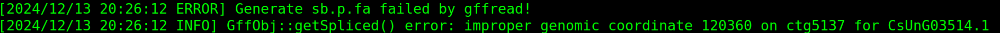

# 常见问题

## GFF文件格式

1. 软件使用正则表达式: `r'^(\S+)\t(\S+)\tCDS\t(\d+)\t+(\d+)\t+(\S+)\t+(\S+)\t+(\S+)\t+.*Parent=([\s\S]+?);'` and `r'^(\S+)\t(\S+)\tCDS\t(\d+)\t+(\d+)\t+(\S+)\t+(\S+)\t+(\S+)\t+.*Parent=([\S\s]+?)$'` 解析GFF文件中第三列为编码序列的行.
2. 软件使用正则表达式: `r'^(\S+)\t(\S+)\t\S+\t(\d+)\t+(\d+)\t+(\S+)\t+(\S+)\t+(\S+)\t+.*ID=([\s\S]+?);Parent=([\s\S]+?);'` and `r'^(\S+)\t(\S+)\t\S+\t(\d+)\t+(\d+)\t+(\S+)\t+(\S+)\t+(\S+)\t+.*ID=([\s\S]+?);Parent=([\s\S]+?)$'` 解析GFF文件中第三列为mRNA的行.

## GFF文件非染色体片段注释质量差，gffread运行失败，删除GFF文件中的非染色体序列的注释行

