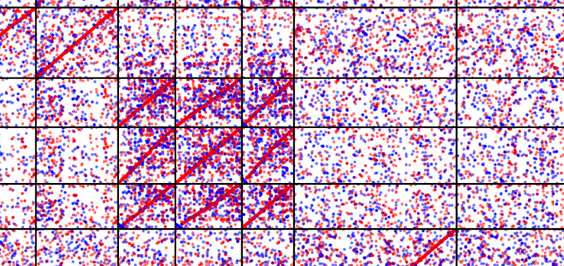

# Document

---

- [Document](#document)
  - [Longest path algorithm](#longest-path-algorithm)
    - [Parameter introduction](#parameter-introduction)

## Longest path algorithm

### Parameter introduction

```command
quota_Anchor col -h
```

```text
  -h, --help            show this help message and exit
  -c , --conf           Configuration files have the lowest priority.
  -i , --input_file_name 
                        Input file(table file).
  -o , --output_coll_name 
                        Output collinearity file.
  -r , --r_value        Reference genome maximum alignment coverage.
  -q , --q_value        Query genome maximum alignment coverage.
  -s , --strict_strand 
                        Specify whether the direction of the gene pairs within a block must be strictly the same or reverse as the block's
                        direction(1:yes;0:no. default: 1).
  -a , --get_all_collinearity 
                        Enable this flag to disable r and q parameters and get all collinear result(default: 0). Options: 0: enable -r -q parameter; 1 or
                        other integer: disable -r -q parameter and get all collinear result.
  -t , --count_style    -r -q parameter's count style for a block, 0: count only the syntenic genes within a block; 1 or other integer: count all genes
                        within a block(default: 0).
  -m , --tandem_length 
                        This parameter is useful only for self vs self synteny alignment. Options: 0 means retain tandem gene pairs; 1 or any other integer
                        means remove gene pairs with a tandem length shorter than the specified integer value(default: 0). When you are doing positioning wgd event relative to species divergent events based ks, you need set this parameter(e.g. -m 500).
  -W , --overlap_window 
                        Collapse BLAST matches. Specify the maximum distance allowed, and only retain best homology pair to synteny analysis under this
                        distance condition(default: 1).
  -D , --maximum_gap_size 
                        Maximum gap size for chain (default: 25).
  -I , --minimum_chain_score 
                        minimum chain score (default: 3).
  -E , --gap_extend_penalty 
                        Chain gap extend penalty (default: -0.005).
  -f , --strict_remove_overlap 
                        Specify whether to strictly remove square region gene pairs for a block to avoid overlap. (1:yes;0:no. default: 0).
  -overwrite, --overwrite
                        Overwrite the output file.
```

1. --input_file
      Some of the file contents are as follows. This file is a tab separated file with 13 columns which can be generated from `quota_Anchor pre_col` function. From left to right, the columns are: `reference gene name`, `reference chromosome name`, `reference gene id` within the chromosome(1-based, e.g. 1,2,3,4...), `reference gene start position`(Note:We use longest transcript start postion in gff file), `reference gene end positiotn`(Note:We use longest transcript end postion in gff file), `reference gene strand`, `query gene name`, `query chromosome name`, `query gene id`, `query gene start position`, `query gene end position`, `query gene strand`, `pident`(The third column of the blast file in outfmt 6 and pident /100 will be as match score).

   ```text
   gene:SORBI_3002G296100    2    3038    67310606    67314182    +    Zm00001eb000010    chr1    1    34722    38366    +    89.1
   gene:SORBI_3004G001400    4    13    122315    123614    -    Zm00001eb000020    chr1    2    41527    45913    -    60.0
   gene:SORBI_3002G280200    2    2870    66167219    66169042    -    Zm00001eb000020    chr1    2    41527    45913    -    61.5
   gene:SORBI_3007G139100    7    1460    56738045    56738551    +    Zm00001eb000020    chr1    2    41527    45913    -    55.8
   ```

2. --output_coll_name
    The first line of the file is the running command text, followed by the header, and the information of the syntenic blocks is displayed from the third line. For the header of the block, from left to right, they are `block id`(1-based), `number of syntenic pairs`, `block score`, `refChr&queryChr` and `blcok direction`(POSITIVE or NEGATIVE).

    Note:
    a)block direction:
    `POSITIVE`: reference gene position and query gene position all increase.
    `NEGATIVE`: reference gene position increase and query gene position decrease.

    b)strand column:
    `+`: reference gene strand is the same as query gene strand.
    `-`: reference gene strand is opposite to query gene strand.

    ```text
    #anchorwave pro -i sb_zm.table -o sb_zm.collinearity -R 2 -Q 1 -D 25 -m 0 -W 1 -c 0 -s 0 -a 1 -I 3 -E -0.005 -f 0
    refGene    refChr    refId    referenceStart    referenceEnd    queryGene    queryChr    queryId    queryStart    queryEnd    strand    score
    ##Alignment    1    N=9    score=4.0115    10&chr2    POSITIVE
    gene:SORBI_3010G065500    10    667    5198737    5201677    Zm00001eb099470    chr2    3037    185608728    185611581    -    0.665
    gene:SORBI_3010G066100    10    673    5269692    5273369    Zm00001eb099640    chr2    3052    186946619    186952568    +    0.556
    gene:SORBI_3010G067300    10    685    5393094    5396312    Zm00001eb099720    chr2    3059    187379803    187383240    -    0.469
    gene:SORBI_3010G068600    10    700    5507755    5515138    Zm00001eb099810    chr2    3068 187672103    187679430    -    0.387
    ```

3. --r_value and --q_value
    `r_value`: Reference genome maximum alignment coverage. In simple terms, The `r_value` means the maximum times of occurrences of a reference gene in the collinearity file.
    `q_value`: Query genome maximum alignment coverage. In simple terms, The `q_value` means the maximum times of occurrences of a query gene in the collinearity file.

    Note: maize and sorghum. The maize lineage has undergone a whole genome duplication (WGD) since its divergence with sorghum, but subsequent chromosomal fusions resulted in these species having the same chromosome number (n = 10). You can set `--r_value 2` and `--q_value 1` if you use sorghum as reference and maize as query which can allow up to two collinear paths for each sorghum gene/anchor while one collinear path for each maize gene/anchor.

4. --strict_strand
    Specify whether the direction of the gene pairs within a block must be strictly the same or reverse as the block's direction.(1:yes;0:no. default: 1).

    Note:
    If you set `--strict_strand 1`. For POSITIVE blocks, in addition to requiring that both the reference gene position and the query gene position all increase, the algorithm also needs to restrict the strand of the gene pair to `+`, which means that the reference gene strand is the same as the query gene strand. For NEGATIVE blocks, in addition to requiring that the reference gene position increase and the query gene position decrease, the algorithm also needs to restrict the strand of the gene pair to `-`, which means that the reference gene strand is the opposite as the query gene strand. To some extent, the relative inversion syntenic gene pairs are removed and block more stable.

    If you set `--strict_strand 0`. For POSITIVE blocks, reference gene position and query gene position all increase. For NEGATIVE blocks, reference gene position increase and query gene position decrease. This is similar to [DAGchainer](https://sourceforge.net/projects/dagchainer/), [MCScanX](https://github.com/wyp1125/MCScanX) and [WGDI](https://github.com/SunPengChuan/wgdi).

5. --get_all_collinearity
   Enable this flag to disable r and q parameters and get all collinear result(default: 0). Options: 0: enable -r -q parameter; 1 or other integer: disable -r -q parameter and get all collinear result.

   Note: If you set `--get_all_collinearity 1`, the algorithm will search all blocks regardless of whether you set `--r_value` and `q_value`. Theoretically, you can also get all collinear blocks by setting -q -r to extremely large numbers, but the speed is very slow. We provide this option to speed up the process of getting all collinear results.

6. --tandem_length
   This parameter is useful only for self vs self synteny alignment. Options: 0 means retain tandem gene pairs; 1 or any other integer means remove gene pairs with a tandem length shorter than the specified integer value(default: 0). When you are doing positioning wgd events relative to species divergent events based ks, you need set this parameter(e.g. -m 500).

   Note:
   1. The part table file of maize vs maize is as follows. The software will search the gene pairs with the same reference gene name and query gene name, so that the software will identify query vs ref as self vs self. Only in this case will the parameter `--tandem_length` take effect, otherwise the software will ignore this parameter. If the reference gene and the query gene are located on the same chromosome and the `absolute value of queryId - refId` (`Abbreviated as abs(queryId - refId)`) is less than or equal to 500, the software will ignore the gene pair.
   2. If `--tandem_length 500` is set, but the reference gene name cannot possibly be the same as the query gene name, this parameter is useless.

       ```text
       Zm00001eb000010    chr1    1    34722    38366    +    Zm00001eb000010    chr1    1    34722    38366    +    100.0
       Zm00001eb320340    chr7    1992    151457760    151461185    -    Zm00001eb000010    chr1    1    34722    38366    +    94.918
       Zm00001eb192920    chr4    2548    180976882    180978457    +    Zm00001eb000010    chr1    1    34722    38366    +    24.324
       Zm00001eb299540    chr7    139    4226770    4244226    +    Zm00001eb000010    chr1    1    34722    38366    +    25.786
       Zm00001eb246440    chr5    3279    185610728    185613090    +    Zm00001eb000010    chr1    1    34722    38366    +    27.547
       Zm00001eb349900    chr8    1579    110289798    110292975    -    Zm00001eb000010    chr1    1    34722    38366    +    20.544
       ```

7. --overlap_window
    Collapse BLAST matches. Specify the maximum distance allowed, and only retain best homology pair to synteny analysis under this distance condition(default: 1).

    Note:
    For every chromosome pair(refChr & queryChr)
    1. For a query gene, if two different reference genes can match this query gene and two reference genes distance `abs(refId1 - refId2)` <= `--overlap_window`, the software will retain a match which has maximum `pident` and remove another match.
    2. For a ref gene, if two different query genes can match this reference gene and two query genes distance `abs(queryId1 - queryId2)` <= `--overlap_window`, the software will retain a match which has maximum `pident` and remove another match.

8. --maximum_gap_size
    For a block, two adjacent gene pairs has a limit which is `abs(refId1-refId2) - 1` <= `--maximum_gap_size` and `abs(queryId1-queryId2) - 1` <= `--maximum_gap_size`.
    And (`abs(refId1-refId2) - 1` + `abs(queryId1-queryId2) - 1`) / 2 as distance between two gene pairs(matches).

9. --gap_extend_penalty
    If gap exists, `gap_penalty` between two matches is equal to `gap_open_penalty + disatance * gap_extend_penalty`.

    Note:
    Without careful parameter adjustment, most synteny software based gene and dynamic programming seem often have some gene pairs with poor match scores at the edge of the syntenic block. If your reference and query species are closely related and you want to get higher quality syntenic blocks, you can set this value to `-0.02`, `-0.03` and so on, but not too high so that no matches are retained.
10. --minimum_chain_score
    minimum chain score (default: 3).

    Note:
    For the default value of 3, since the match score is `pident/100` (<=1), the number of syntenic gene pairs for any block is greater than or equal to 3.
11. --count_style
    -r -q parameter's count style for a block(default: 0). 0: count only the syntenic genes within a block; 1 or other integer: count all genes.

    Note:
    Under the premise that the --r_value parameter is set to 2 and the --q_value parameter is set to 1, if --count_style is set to 1, take the following figure as an example, if the number of genes contained in the chromosome region of the reference species corresponding to the square area surrounded by the dotted line in the blue area is less than or equal to `--maximum_gap_size - 1`, and the number of genes contained in the chromosome region of the corresponding query species is also less than or equal to `--maximum_gap_size - 1`, then the two collinear regions between chromosome a and chromosome 1 should be one block instead of two blocks(if `matchscore + gap_penalty` > 0), and the software will count all the genes between the two reference genes at both ends of the block, and of course, it will also count all the genes between the two query genes at both ends of the block.
    If count_style is set to 0, the software will only count the syntenic genes between the genes at both ends.
    <p align="center">
    
    </p>

12. --strict_remove_overlap
    Specify whether to strictly remove square region gene pairs for a block to avoid overlap. (1:yes;0:no. default: 0).
    Note:
    If there are a large number of so-called tandem duplications or proximal duplications gene pairs for the two chromosomes being compared, as shown in the figure below, there may be a large number of colinear regions between the two chromosomes. If this parameter is set to 1. When the software identifies a block based on the maximum block score, the gene pairs obtained by crossing the two gene sets corresponding to the two(reference and query) chromosome regions of the block will be ignored, so that only this block is retained. When using this parameter, you may need to increase --gap_extend_penalty (e.g. -0.02 or -0.03) to prevent poorer gene pairs on either side of the block from affecting the results.
    In general, `--overlap_window` is sufficient, so there is no need to set this parameter.
    <p align="center">
    
    </p>
